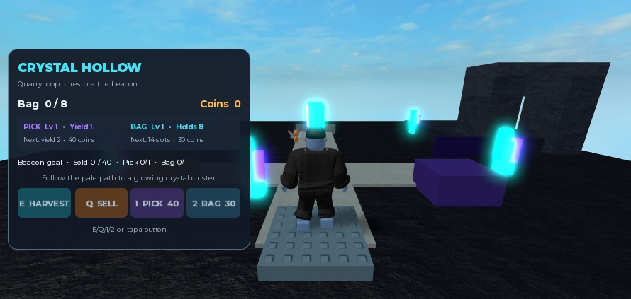
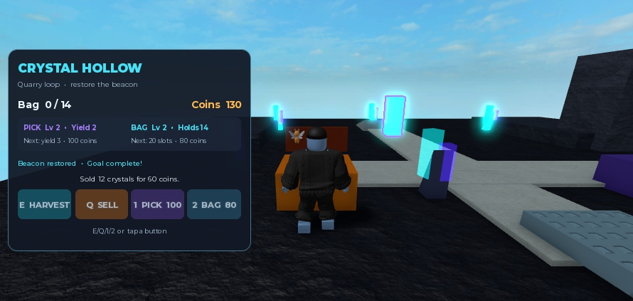

# Crystal Hollow native verification — 2026-09-15

## Result

The frozen expert-refined candidate passed the observed solo harvest → sell → upgrade → goal → respawn loop. Its rendered world remains a blockout and fails the requested visual-polish target. This is Luna output with recorded expert corrections, not an unassisted model-quality success.

- Candidate: `C:/Users/7474g/Downloads/Takko-Crystal-Hollow.rbxlx`.
- Export SHA256: `abaa4fd77678738f40e271b85919fd3a1055b45f4e7be981ad439e93477039b5`.
- Artifact: `d55974385a91b4777c5da8725d341ff8a42e33e1873883c5e4b881a2d6c73f3f`.
- Studio: `54bc2614-9a3a-420d-9ef8-9da9569914e5`.
- All seven live Edit-mode script sources matched the frozen artifact byte-for-byte.
- [Raw native observations](results/crystal-hollow-native-verification.json).

## Observed gameplay

| Scenario | Actual result |
| --- | --- |
| Fresh join | Carry 0, coins 0, capacity 8, both upgrade levels 0, total sold 0, incomplete goal |
| Harvest and capacity | E collects; repeated harvests reach 8; overflow attempt stays 8 |
| First sale | Q clears 8 carried crystals, awards 40 coins and records 8 sold |
| Empty sale | Currency and sold count unchanged |
| Pick purchase | Actual HUD click spends 40 coins, raises PowerLevel to 1; subsequent isolated harvest yields 2 |
| Unaffordable bag purchase | Actual HUD click leaves currency and levels unchanged |
| Depleted node | Remaining 0 / Available false; extra harvest awards nothing; later stock is available again |
| Bag purchase | After another legitimate sale, actual HUD click spends 30 coins, capacity rises to 14 |
| Expanded capacity | Actual harvests reach 14 without overflow |
| Goal | TotalSold 40 with both upgrades 1 sets GoalComplete true; label reads “Beacon restored”; local beacon Highlight exists |
| Respawn | Actual LoadCharacterAsync retains carry 2, coins 130, upgrades, capacity, sold count and goal; one HUD remains |
| Continue after goal | Further sale clears 2 carry, raises coins to 140 and TotalSold to 42 |
| Console | Empty output at checks after goal and final sale |

These actions used the generated E/Q input handlers and actual mouse clicks on generated HUD buttons. Server calls arranged avatar position and invoked respawn; they did not grant currency, inventory or upgrades. Travel time and natural walking routes were therefore not evaluated.

Studio MCP rejects One/Two virtual key presses because they are permanently bound to CoreGUI actions. This is an automation limitation, not evidence that human number-key input is broken. Upgrade functionality was verified through the actual HUD buttons instead.

## Visual observations and remaining defect

The floor is a large dark square, crystal silhouettes resemble upright rods, stations are colored blocks, and terraces/arch do not form a convincing quarry. The HUD text fits at the observed viewport, but visual polish is not established by that fact.

The sale message overwrites the restoration toast even though the goal label and Highlight update correctly. A separate revision will fix presentation ordering and improve world composition; these native results do not transfer automatically to that revision.

A separate iPhone 17 Pro landscape device simulation rendered at a 750×361 viewport. HUD labels and buttons fit, with every text element reporting TextFits=true, although the panel occupies much of the left viewport. The game uses LandscapeSensor, so no portrait test was forced. This was a layout check, not touch-control gameplay acceptance. [Mobile screenshot](results/crystal-hollow-native-mobile.jpg) and [raw device observations](results/crystal-hollow-native-mobile.json). Play was stopped and Studio reset to its default viewport.

No multiplayer isolation, touch gameplay, adversarial remote requests, long-session performance or player walking-route tests were run.

No new model/provider calls were made during this verification.
