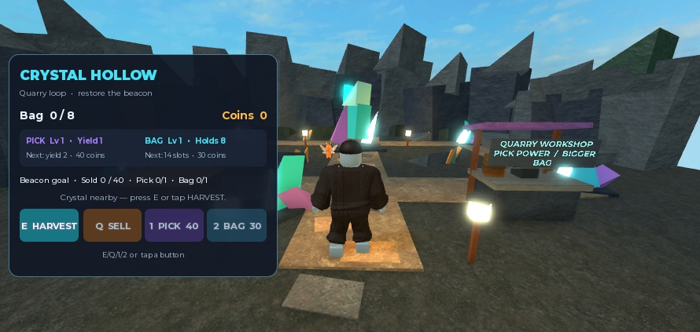
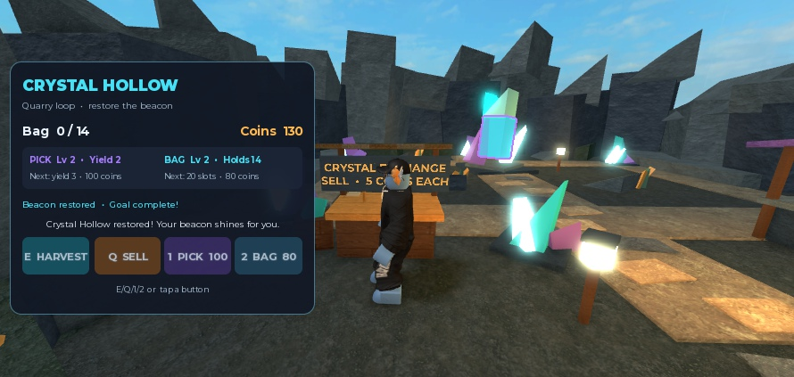

# Crystal Hollow visual V2 — native result

Date: 2026-09-15. [Raw native evidence](results/crystal-hollow-polished-native-verification.json).

## Outcome

The updated quarry is applied in the connected Studio place and its observed solo gameplay loop passes. The separate saved place is `C:/Users/7474g/Downloads/Takko-Crystal-Hollow-Polished-v2.rbxlx`.

This is a separately authored expert scene and feedback revision of the generated game. It is not an unassisted Luna result, a controlled model comparison or proof of general generation quality.

The native view now has enclosing quarry walls, angled crystal silhouettes, distinct merchant/workshop structures, readable signs, paths, planting and lantern landmarks. The geometry remains a stylized prototype; user aesthetic acceptance is still open.

## Native gameplay checks

- Fresh solo player: carry 0, coins 0, capacity 8, no upgrades, goal incomplete.
- Official character navigation reaches each of the six harvest nodes and both stations; the previously obstructed northern node is reachable and harvestable.
- Real E input reaches capacity 8; additional harvesting cannot overflow it.
- Real Q input sells 8 crystals for 40 coins and increments TotalSold to 8; empty sale adds nothing.
- Actual pick-button click spends 40 coins; an isolated subsequent harvest yields 2. An unaffordable bag-button click leaves state unchanged.
- Another sale funds the bag upgrade; actual bag-button click raises capacity to 14. Northern-node harvesting reaches that capacity.
- Depleted nodes become unavailable; other nodes support continued harvesting. Partially used stock remains partially used until depletion/refill, as designed.
- At TotalSold 40 and both upgrades 1, GoalComplete becomes true. The goal label, beacon Highlight and completion toast all appear; the sale message no longer replaces the completion toast.
- Actual character respawn preserves carry 2, coins 130, capacity 14, both upgrade levels, TotalSold 40 and completed goal. Exactly one HUD remains.
- Another real sale after respawn clears carry, produces coins 140 and TotalSold 42.
- Console output at completion is empty. Play is stopped, leaving a fresh start for the user.

These interactions used the real generated input handlers. No currency, inventory, upgrade or goal attributes were injected. This revision used the official navigation tool between targets, rather than server-side avatar teleportation; the first frozen candidate used teleportation for test arrangement.

## Artifact and application integrity

- Artifact hash: `5190a564e55264c10ac8d1a4da30ef3a076cdf88c77d6a149c8479a3b6603eb9`.
- Saved-place SHA256: `6ff9e32c4cd1a98336fbb784628c680fa6660324331508d545ce24d920b7c35a`.
- All seven live script sources match the V2 artifact exactly.
- All 194 declared World nodes and 1,282 declared properties match their engine-canonical values. Three existing Snap objects under Ground remain outside the authored manifest; they were preserved.
- Dedicated `multi_edit` updated only HUD and Feedback. The scoped scene updater applied 26 property updates, 152 additions and 14 decorative leaf replacements.
- Initial preflight correctly stopped on Roblox's stored color quantization; a temporary Part confirmed setter canonicalization. A tested correction compares engine-setter values and still rejects genuinely changed properties.
- Studio's TryBeginRecording returned nil without an error. Strict mode aborted unchanged. An explicitly selected mode then applied the scoped update with checked rollback and preserved original exports, reporting ownUndoRecorded=false. No capability or permission settings changed.

The full product check passed 218 unit/API tests, 10 desktop tests and 34 browser tests plus all other required stages. Later scene-updater-only changes passed 21 targeted tests, TypeScript checks and emitted Luau compilation. See [art implementation](crystal-hollow-visual-polish.md).

## Remaining limits

No multiplayer isolation, touch gameplay, long-session performance, persistence or broad model-quality result is established. The prior phone-sized landscape layout observation belongs to the frozen candidate; this revised scene's native screenshots were desktop views. No additional paid model calls were made.
