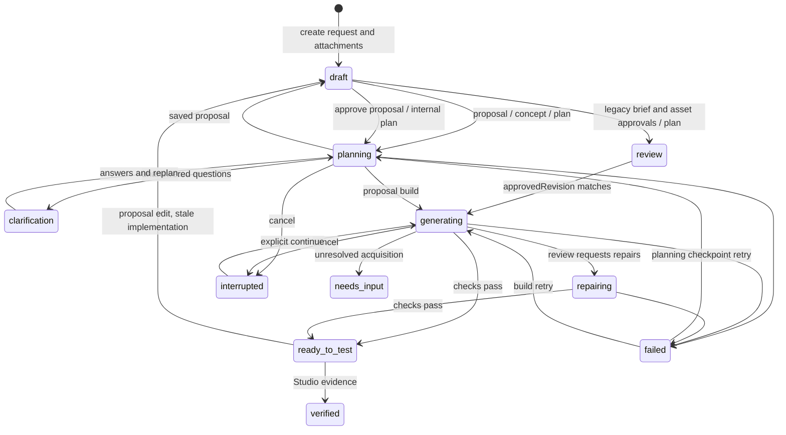

# Chat and asset flow, before redesign

Source inspection on 2026-09-29, branch codex/marketplace-asset-library. This maps the working source, not proof that the Part 4 package contains identical code. No user project was opened, saved or retried. The existing service remains PID 44976 on 62514.

## State graph

Queued messages are a parallel state machine: queued → applying → applied, or held/cancelled. A worker checkpoint interrupts a running job and applies queued edits. Applying an edit does not automatically approve a revised build.

## Saved state ownership

| State | Producer / writes | Readers / gates |
| --- | --- | --- |
| request | POST projects, PATCH project, Engine update | planner context, brief hash, App local request equality |
| answers and answerQuestions | PATCH, messages, proposal question and platform answers | concept, proposal questions, planning, App local answers |
| briefChanges | messages on legacy projects | bounded accumulated brief context |
| concept, conceptQuestions, conceptAcceptedRevision | concept generation / acceptance | legacy planning preflight, GameConcept |
| briefApprovedRevision | approve-brief, saveChoices, defer/reopen | legacy plan and asset routes |
| proposal sections, questions, assetNeeds | proposal generation and applyProposalPatch | Proposal, AssetCard, planner, approval hash |
| proposal hash, revision, approval | refreshProposal / approveProposal | build preflight, retry and dependency map |
| spec assetNeeds | direct or coordinated planner output | acquisition and approvedAssetLinks, preferred over proposal needs |
| assetDiscovery groups | assetSearches, discovery routes, picking initialize, normalizeNeeds | asset card, Marketplace, selection validation, approved adapter |
| assetDiscovery choices, pinned, approved, revision | choose/clip/remove/auto, saveChoices, defer/reopen | pickStatus, proposal hash, approval, planning context and acquisition |
| assetAttachments | project creation, PATCH, messages, picking save, saveChoices | planner context, proposal hash, composer initial state and receiveAssetProject |
| assetChoiceAttachmentIds | picking save / initialize | decides which derived attachments may be removed |
| sourceReview and inspection | asset library capture and decision analysis | pickStatus, build approval and adapter screening |
| selected clip / animation packs | clip route, marketplace-animations | preview, selected-clip-context, generated playback references |
| revision and approvedRevision | mutations and approvals | optimistic concurrency, generation preflight |
| coordination outline/areas/inputHash | coordinator checkpoints | planningRetry, resumed planning and assembled spec |
| proposalPlan / implementationCandidate | scoped plan and failed implementation retention | affectedTasks and retry eligibility |
| artifact, completedBuildTasks, review/checks | builder and reviewer | result card, retries, export, Studio |
| generation, charges, reservedMicros | engine and provider accounting | budget enforcement, retry quote, buildEstimate |
| queuedMessages / submissions | submitChange, queue boundary, applyQueuedChanges | conversation status, idempotency, retry restrictions |
| sessionStorage takko-draft-ID | composer onChange, successful submission cleanup | selected project composer restoration |
| sessionStorage takko-answers-ID | changeAnswers, answer cleanup | local answers restored only for matching revision |
| localStorage marketplace Studio ID | useAssetAttachments.chooseStudio | Marketplace connection, attachment capture |

Project JSON persistence is GenerationStore.save. GenerationStore.get performs an in-memory asset migration before returning. That migration currently refuses every project with a spec. Local composer state is independent of saved state and is also overwritten by receiveAssetProject.

The route index and baseline gate source contexts are in [flow-gate-inventory.md](flow-gate-inventory.md). Baseline: **124 ConflictError construction lines**. The 121 disabled-related lines include prop declarations and forwarding. They are not 121 independent gates. There are 99 explicit UI message/error setter lines. These counts exclude schema failures and ordinary Error throws.

## Reported failures and source evidence

1. The exact asset-replacement draft error is absent from current src. Current submitChange accepts changed attachments but treats the composer list as a replacement for saved references, deleting choices missing from it. The release symptom cannot be claimed reproduced from this checkout.
2. App's conceptDirty combines hidden request equality, answers and attachment equality. AssetCard receives “Save your brief changes before building.” The new proposal chat does not expose a corresponding brief save control.
3. Composer Enter prevents the browser default but only submits when request equals project.request and busy/inspection are false. The button shares these conditions. A mismatch yields no submission. Asset checks also return silently when their lock is occupied.
4. buildEstimate returns null without successful builder calls and a spec. Both proposal and asset card display the unavailable message. No cross-project historical fallback exists.
5. There is no per-need Skip button. pickStatus makes a skipped choice buildable only if the discovery aggregate is approved. Chat edits still pass idle locks and the hidden composer request guard.
6. pickStatus describes choosing a sound inside a model, but AssetCard only opens ClipSheet for animation. Choices carry clipKey, with no equivalent sound selection path in this card. The warning is not itself a playback binding.
7. decisionBody denies oversized payloads at 16,384 bytes, or 32,000 for complete script sources. The latter must retain complete source evidence. Simply truncating it would defeat screening. Call sites must distinguish optional proposal analysis from required source validation.
8. Marketplace disables the Asset type selector whenever picking is set. Its pick search request omits kind, so enabling the selector alone would still leave the server searching the old type.
9. receiveAssetProject unconditionally copies saved assetAttachments into the composer. picking.save itself derives those attachments from selected discovery choices. Saved picks are therefore presented as new message input.
10. migrateAssetNeeds skips any project with a spec and never rewrites coordination.areas. Coordinated worker output prefixes asset need IDs. Normalizing top-level groups cannot correct a cached worker's duplicate needs. Current approvedAssetLinks deduplicates returned links but does not establish checkpoint correctness. The exact reported duplicate message is absent from current src, so a production-shaped migration regression is still required.
11. The hidden dirty comparison remains active. Layout and one-second click feedback need rendered Electron verification. Source inspection alone cannot establish that composer overlap is gone.

## Assessment

The duplicated-state hypothesis is supported. Proposal needs, spec needs, discovery groups/choices, derived attachments and composer attachments all carry selection identity. Hashes bind several of these copies, and approval routes mutate them again. Legacy concept → brief → assets → plan approvals coexist with proposal approval. This produces hidden prerequisites and changes to the content being approved during approval itself.

Keep concurrency, budget, provider, dangerous-source and native-effect protections. Remove separate user approval of derived state. Missing picks need direct Choose and Skip actions. Provider and budget failures need Models and Budget actions. Stale concurrent edits need durable message acceptance, not lost input.

## Verification limits

This phase is source mapping only. No model inference, no real-project mutation, no app restart, no Studio session. No automated journey has run yet. The inventory exposes source contexts but does not certify all runtime error paths or action reachability. Those require the planned tests and exploration.
