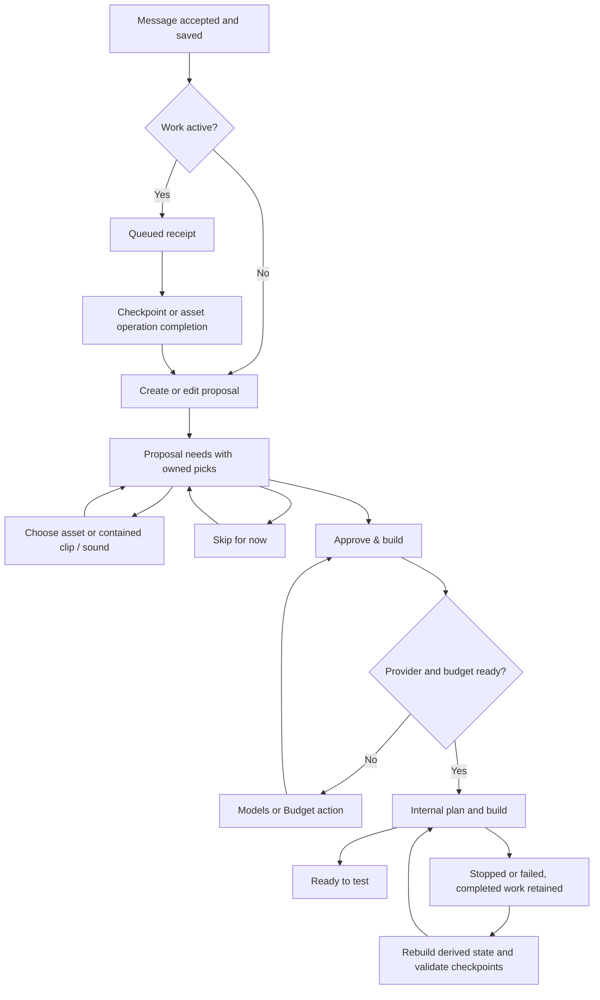

# Conversation and proposal asset model

## Invariants

Each proposal asset need owns one host-managed pick: chosen asset and inspected listing, optional clip or embedded sound identity, validation, and explicit skipped state. Search results are candidates, not approvals. Discovery groups and attachments used by the builder become projections of these picks. They cannot be approved independently.

The planner owns descriptions and scope. The host owns picks and validation. A planner patch retains a pick only when the need's identity and semantics remain unchanged. A changed or removed need invalidates only its dependent work. A source validation warning cannot silently become successful validation.

Conversation messages are durable input. Save a receipt before dispatching work. Busy work queues messages, including asset operations. Provider errors leave a visible accepted message with Retry or Models, not an unsent draft. Idempotency prevents duplicate dispatch. Composer attachments are new input only, never a mirror of saved picks. Clear only the submitted input, preserving text typed while a request is pending.

Brief and concept transitions are internal. There is one user build approval, Approve & build. Its user prerequisites are required needs resolved or explicitly skipped, a connected provider, and budget remaining. A busy operation exposes queued input and Stop. Every unmet prerequisite names the need or setting and supplies an action.

## Flow

## Asset actions

Every need has Choose and Skip for now. Choosing for the user with no relevant result leaves the need unresolved and presents Broader search and Skip together. Broadening never substitutes irrelevant assets. An explicit chat request to skip a named need is a deterministic host edit and requires no inference.

Model packs can satisfy Audio or Animation needs only through a contained reference. A sound picker uses captured Sound objects and content IDs. A missing preview is a visible limitation, not a selection prohibition. Dangerous source findings remain a validation failure with Choose another and Skip actions. Audio playback permissions remain a Studio check.

Marketplace type changes must reach the search route and trigger visible search feedback. Search type does not rewrite the need's required media type. Compatible packs may be searched without changing that need.

## Estimates

Use successful builder charges when available. Otherwise use actual historical builder averages available to the service and label the result historical. Never invent a quote or present a planning charge as a builder measurement. If no historical builder samples exist, show a labelled budget-based planning allowance with its basis, not an unavailable estimate that looks like a build prerequisite. Actual cumulative cap enforcement remains unchanged.

## Migration and retries

On loading legacy data, resolve exact need identity and planner selectedAssetId first. Collapse equivalent duplicate groups and import their inspected choice into the proposal need. Conflicting legacy choices remain unresolved with a Choose or Skip action. Do not guess by uploader asset names.

Rebuild derived discovery groups and attachments from canonical picks before retry eligibility and dispatch. Reconcile worker assetNeeds with current proposal identities. Reuse a checkpoint only when its normalized input and dependencies still match. Preserve original failure history and billing. Invalidate conflicting worker output instead of relabelling stale output as current. The migration runs on synthetic copies in tests, never the user's projects during this task.

## Delete list

- Composer request-equality guards and hidden brief-save hints.
- receiveAssetProject's composer attachment repopulation.
- Separate brief and asset approval controls in the proposal chat path.
- Approval-time mutation through discovery.saveChoices for canonical projects.
- Discovery approval as a prerequisite for skipped canonical needs.
- Attachment replacement semantics for additive chat attachments.
- Independently persisted canonical discovery choices and approval flags. Keep only derived compatibility projections where downstream adapters need the shape.
- Retry normalization that skips all projects with a spec.
- Silent no-op submit conditions without visible status.
- The picking-mode disabled Asset type selector.

Concurrency checks, real budget reservations, source screening, schema validation, native-effect reconciliation and scoped file ownership remain. These are integrity checks, not extra user approvals. Their recovery surfaces must be explicit.

## Proof and delivery

Use test-driven regression work and existing producer contracts. Add seven Electron journeys with mocked provider and Marketplace boundaries. No paid endpoints or user projects. Assert accepted/queued/applied receipts and visible feedback after actions. Retain every exploratory pass, including failures. Review the final diff, run one final npm run check, then package a new release and shortcut with a completely empty workspace. Report source-site gate counts separately from user-visible prerequisites.

Skills: choose-skill, code-showcase-systematic-debugging, test-driven-development, code-review-excellence, webapp-testing. Apply webapp-testing's rendered-state reconnaissance with the repository's JavaScript Playwright/Electron tooling, as required by this task, rather than introducing Python.
