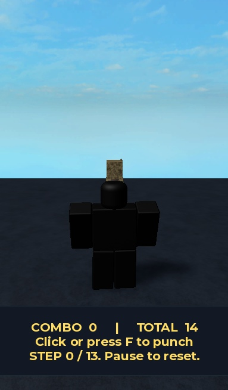

# Guided combat demo rehearsal

The manually repaired demo works in a reopened local Studio export. Ten native scenarios passed, including 13 mouse clicks producing 13 server-confirmed hits, visible combo/total counters, death cancellation and respawn. This is not a successful Takko generation or a cheaper-model evaluation. No production application code, running Takko process, model setting or provider credential was changed.

The user requested this hands-on rehearsal on 2026-10-01 to identify what a capable builder does and use it to guide the architecture. Skills used: `agent-orchestration-multi-agent-optimize`, `agent-evals` and the native `rbx-docs-search` reference skill. The record contains observations, decisions, short rationales and tests, not private chain of thought.

## Deliverable and evidence

- Open `.forge/exports/guided-demo/GuidedCombatDemo.rbxlx` in Studio, select desktop/default simulation, and press Play. Face the straw dummy and click or press F. Each click starts or buffers a segment. A held mouse button does not auto-chain. Combo hits reset when the chain ends or times out. Total hits accumulate.
- The new `GuidedCombatDemo.rbxlx` Studio window is left in Edit with desktop/default simulation. The original inspection place was restored to two Workspace children and zero scripts. `Place1` was not edited. No test service was started.
- [Action and native observation record](results/guided-demo-rehearsal/session.json), including searches, asset source, failures and sampled runtime timelines.
- [Exact body-pose comparison](results/guided-demo-rehearsal/pose-comparison.json). All 996 body pose keys across six tracks matched the preserved producer fixture, with zero numerical difference across 7968 compared numbers. This comparison excludes HumanoidRootPart, as the original producer does.
- [Runtime source](results/guided-demo-rehearsal/Combo.luau), [configuration](results/guided-demo-rehearsal/ComboConfig.luau), [server](results/guided-demo-rehearsal/ComboServer.luau), [client/HUD](results/guided-demo-rehearsal/ComboClient.luau), and [22 offline contracts](../tests/guided-demo-rehearsal.test.ts).
- [Export helper](../scripts/export-guided-demo.mjs) reconstructs the local place from this session's native serialized captures. Those captures and the place are ignored local exports, not files fetched or reconstructed by the helper. A fresh checkout does not contain them.

This is an intentionally small, unpolished training arena. The screenshot was taken after the combo reset, so it shows combo 0 and total 14. The timeline records combo 13 before reset. The animation is registered from a retained KeyframeSequence for Studio playback. Publishing requires a permitted published animation ID, as explained in the [Roblox KeyframeSequenceProvider reference](https://create.roblox.com/docs/reference/engine/classes/KeyframeSequenceProvider). Nothing was published.

## What was actually done

1. Checked the brief, repository state, live service and available Studios. The original inspection Studio disconnected during preparation. Reopened its existing empty inspection file and rechecked the zero-script baseline before editing.
2. Ran three live Creator Store searches: training dummy, punch animation and punch impact. Returned four candidates per query. Inspected eight model assets as detached instances and attempted one Audio import. Disabled asset scripts and removal sounds while detached. Did not execute third-party source.
3. Selected the previously approved R6 infinity-punches pack and straw target to preserve the user's exact demo. These are known diagnostic assets, not a fresh holdout. Added a sound extracted from a newly inspected combat script container.
4. Started from the preserved P-Build 2 four-file output. Kept that original output and its 18/20 result unchanged. Corrected the derivative test's consumed-pending access and used the numeric `Combo.hit` contract directly. Reproduced the real timeout defect with 19/20 passing, then removed the unintended extra 0.15-second allowance. Added HUD, keyboard/button input, extracted-sound playback and a current-combo counter alongside total hits.
5. Reproduced buffered-track drift with a failing fake-track contract, then made each buffered segment seek to its intended start. The derivative now passes 22/22 offline contracts. The implementation changes live only in the demonstration artifact.
6. Tested actual native input, animation tracks and body motion, server counters, rejection cases, death and respawn. Found and corrected the test window's iPhone input emulation. Preserved the initial unsuccessful coordinate click instead of counting the tool's success acknowledgement as gameplay success.
7. Serialized the native scene, animation, rig and four scripts, exported with the existing pinned Rojo binary, and reopened the resulting place in a separate Studio window. Compared all four script bodies with the intended derivative and the body poses with the preserved capture. Ran the final ten scenarios against that reopened export.
8. Stopped Play and removed runtime-only probes by ending the session. The inspection place is empty again with its original simulator settings restored. The new deliverable retains its authored objects and four scripts, with no probe objects. It is left in Edit with desktop input selected.

## Asset decisions and their evidence

| Asset | Actual contents | Decision for this request |
|---|---|---|
| 8767186735 Training Dummy | Anchored parts, Humanoid and Animate source, but no Motor6D joints. Animate waits for absent shoulder/hip/neck joints. | Usable as static decoration. Its animation behavior is not usable as shipped. Do not infer functionality from the name or presence of a Humanoid. |
| 1245720733 Training Dummy | Mixed anchoring and a respawn script that clones its parent and calls MakeJoints. | Inspectable existing behavior, unnecessary for this immutable target. No claim that every behavior/security property was verified. |
| 12061946559 R15 Punching Animations | Raw R15 sequences and rigs. The only script is a comment note. | Wrong skeleton for the approved R6 request. Could serve an R15 request or a separately validated retargeting workflow. |
| 80460719695191 R6 combo moveset | Five raw R6 sequences, including idle/equip and three swings. No scripts or sounds. | Plausible alternative. Does not supply evidence for the approved 13-hit sequence. Do not silently substitute it. |
| 2801965424 Punch Animation | R15 sequences plus an opaque TestAnim reference. | Native sequences are meaningful evidence. The reference alone is not a usable published animation ID. |
| 9280156718 punch animation script | Root Script, another Script and twelve nested Sound instances containing six unique sound IDs. Full source includes Tool assumptions and a much broader combat/ragdoll system. | Extract only Punch sound 3932505023 into a newly created Sound. Do not import the surrounding scripts. Native sound loaded with duration 0.4846667 seconds. This does not certify the whole asset as safe or prove access in a published experience. |
| 15008746676 selected R6 pack | Five sequences, no scripts/sounds. The selected infinity punches has 166 frames and duration 2.75 seconds. | Keep the approved sequence and previously reviewed hit timing. Retain the actual keyframes. Confirm exported body poses match the producer fixture. |
| 10161087974 selected straw target | Parts and unions, no scripts or Humanoid. | Fully sufficient as a static server-tested target. Missing Humanoid is not a rejection reason. |
| 96359585058783 Audio candidate | GetObjects returned Invalid XML. | Wrong acquisition method for Audio, not evidence that the audio is incompatible. Do not repair generated game code or reject the asset based on this error. Direct Audio candidates were not otherwise tested. |

Large returned Lua tables hid source behind `[Complex Table]`. Explicit JSON exposed the source, but a later single-call pose dump was also truncated. Six bounded pages resolved that independently. Production tools need typed, paged results with completeness flags. Models must not treat a shortened summary as a complete inspection.

The device-mode repair used Roblox's documented [StudioDeviceSimulatorService](https://create.roblox.com/docs/reference/engine/classes/StudioDeviceSimulatorService). It stopped simulation only in the owned test window. Input capability checks then showed mouse and keyboard enabled, and the subsequent mouse event was observed in the game.

## Native acceptance on the reopened export

| Scenario | Observed result |
|---|---|
| Normal spawn, one desktop click | Unanchored R6 character spawned at (0,3,0), facing the dummy. One input, total 0 to 1. |
| Thirteen separated clicks | Thirteen inputs, total 1 to 14, combo reached 13. Track reached 2.75 seconds with held boundaries and body motion. |
| Keyboard F | Total 14 to 15. |
| Out of range | Total remained 15. |
| Facing away | Total remained 15. |
| Wall blocks target | Total remained 15. |
| Hold mouse button | Exactly one hit, total 15 to 16. |
| Inject stale, out-of-order and malformed remote requests | Total remained 16. This is a direct hostile-client test, not a user-input test. |
| Death before scheduled hit | Health 0, nonce rotated, total remained 16. |
| Automatic respawn and new F input | Health 100, unanchored character, new nonce, total 16 to 17. Sound still loaded. |

The final Studio console was empty. Before the final playback correction, a separate rapid-input native run registered twenty input edges and sixteen hits: one full combo and three hits in the next. It stopped after input ceased. That observation belongs to the earlier derivative revision, not the final export's ten-scenario result.

Offline verification: 22 new Luau-backed contracts pass. The initial timeout regression failed 1/20 and the later buffered-playback regression failed 1/22 before their respective fixes. The full repository check passed as recorded below. Offline tests do not establish marketplace access, Studio rendering, multiplayer reliability or gameplay quality.

## Procedure to give a smaller model

Six [decision cases](results/guided-demo-rehearsal/decision-cases.json) package observed failures and expected routing decisions for future evaluations. They are evaluation inputs, not evidence that a smaller model has passed.

Use explicit work packets with `request`, `requiredCapabilities`, `evidenceRefs`, `coverage`, `chosenAsset`, `missingBindings`, `allowedEdits`, `acceptanceTests`, `budgetRemaining` and `stopReason`. Save raw source/media outside the prompt. Retrieve relevant source and dependency slices when needed. Include all unique evidence needed for the decision. Do not repeatedly send the entire asset tree, source pack, requirements and previous conversations.

| Host-controlled stage | Model's bounded job | Required result before advancing |
|---|---|---|
| Specify | Translate intent into observable behavior and identify genuine ambiguities. | Requirements and tests, including chosen assets, target platform and publishing scope. |
| Acquire and inspect | Explain native evidence and identify dependencies. | Complete typed instance/media/source manifest, import status and unresolved references. No imported script execution. |
| Integrate | Propose the smallest extraction, placement or source adaptation needed. | Concrete edit plan tied to paths and dependencies, plus tests. Preserve selected content and useful behavior. |
| Implement | Write only missing behavior and adapters. | Compileable source that meets the actual producer/consumer interfaces. |
| Verify and repair | Diagnose the first concrete failed assertion. | Targeted patch and rerun of the affected contract. Budgeted attempts, no full regeneration by default. |
| Export and accept | Interpret native observations. | Reopen exact export, compare intended content, run input-to-outcome scenarios, preserve failures and clean temporary state. |

For this demo, inspection deterministically supplies the rig, clip, target and sound. A model need not rediscover those facts during coding. The next work item after a wrong Audio importer or a missing mouse event belongs to acquisition or environment setup, not to game-code regeneration.

Keep a concise decision entry for each transition: observation, evidence reference, chosen action, reason, next assertion, result, actual call usage and remaining reservation. For example: "Mouse tool returned success, but InputBegan count is zero. Read device capabilities. Touch emulation is active. Switch the owned test window to desktop and repeat one click. Expect one input and one confirmed hit." This is a reusable training example with an objective answer.

## Architecture implications across game genres

Keep the existing deterministic direct build path. This rehearsal gives no reason to replace it with LangGraph, AutoGen or CrewAI. Extend its state and evidence contracts instead:

1. **Capability-based asset integration.** Compatibility belongs to an asset revision, requested role, integration plan and runtime. Preserve both reusable parts and useful existing behavior. Distinguish missing bindings, inspectable dependencies, inaccessible content and actual blockers. A static dummy does not need a Humanoid, and audio can be nested inside executable containers.
2. **Deterministic environment preflight.** Assert Studio identity, Edit/Play context, device/input mode, expected rig, scope ownership and dependencies. A failed test harness must not trigger paid game-code repairs.
3. **Persistent artifact state with bounded evidence retrieval.** Store immutable acquired bytes or verified revisions, native manifests, dependency graphs, approved timing, source changes and test results. Return explicit truncation/coverage status. Cache by content and integration context, invalidate when either changes.
4. **Contracts at real boundaries.** Tests consume the real producer result. Luau numeric hit counts are not booleans. A success acknowledgement is not an input event. Compilation is not animation playback. Passing a mock is not a reopened-place test.
5. **Targeted bounded repair.** Route a concrete failure to its owning stage. Permit local repairs within a stated reservation and attempt cap, then stop with evidence. Do not choose replacement assets or restart planning just because a compatible asset requires wiring.
6. **Model cascading after measurement.** Use ordinary code for traversal, filtering, serialization, finite transitions, accounting and repeatable checks. Use a cheaper model for bounded tasks it passes on held-out evaluations. Escalate unresolved dependency analysis or novel behavior once within an approved budget. Choosing the cheapest model for every phase is not the objective. Measure cost per accepted artifact.
7. **Protected acceptance capacity.** Reserve verification and packaging work before spending on generation. Reopen the delivered artifact and exercise gameplay. Preserve the distinction between Studio-ready and publishable. Keep installed, staged and source versions visible in results.

The same stages can build a racer, farming game, obby or novel mechanic. Their capability requirements, integration code and acceptance scenarios differ. This single combat example cannot establish support for all genres or arbitrary marketplace content.

For an NPC with existing walking and behavior scripts, inspect Script/LocalScript/ModuleScript types, RunContext, `script.Parent` and relative lookups, required modules, remotes, services, rig joints, controller ownership and client/server assumptions. A server Script under an NPC in Workspace can already be in a correct location. Moving every Script to ServerScriptService would break many parent references. Prefer preserving a working subtree, or add explicit bindings and adapt references when relocation is necessary. Test the original behavior and the adapted behavior in isolation. This session demonstrated extraction, not NPC behavior-preserving relocation. That remains a required independent regression case.

## Cost, limitations and next validation

Takko provider calls: zero. Direct project-provider charge: $0. No vault access, balance refresh or paid retry. This assistant session still consumes the user's assistant allowance, which is not included in that $0. Its exact token/cost total is unavailable here. The previous provider balance remains historical, not a current balance measurement.

This rehearsal does not prove a token-cost reduction. It reused known assets, reviewed timing and previous model code, then received manual repairs and native testing by a capable agent. An honest before/after comparison must hold requests/assets and success criteria fixed, capture provider-reported input/output/cache/reasoning usage and charges, include failed attempts, and compare success rate, repair count, latency and total cost per accepted export. Mocked provider runs test routing and caps, not real prices or generation quality.

Next implementation should be one vertical slice through the existing host: complete paged asset evidence, capability gaps, environment preflight and a persisted acceptance result on the exact export. Add the demonstrated regressions first. Then evaluate independent assets and genres, including nested audio, a working scripted NPC and a novel mechanic. Paid model comparison requires a separately authorized run and budget. The broader full generation trial remains paused.

## Repository verification

Full `npm run check` passed once, exit 0, with no worker crash, rerun or skipped stage. Results: build/typecheck, 1911 unit tests in 150 files, 6 Luau scenarios, 16 plugin scenarios plus plugin/8 injected-source compilation, 6 guard cases, CSS 0 errors/274 existing warnings, 21 desktop lifecycle tests, production smoke, 108 desktop browser tests and 10 Electron journeys. Log: `test-artifacts/guided-demo-full-check.log`. The 22 new contracts are included in the 1911 total. Native acceptance is separate.

The live Takko PIDs remained 28600/14992, with service on 127.0.0.1:51256. Test port 4319 was released. Automatic approval review rejected deletion of the current test-owned `.forge/e2e-projects/run-4644` and ten `takko-electron-journey-*` directories created between 05:50 and 05:52 UTC, stating only "blocked by policy". All eleven remain. Original failure records and earlier cleanup leftovers were not altered.
