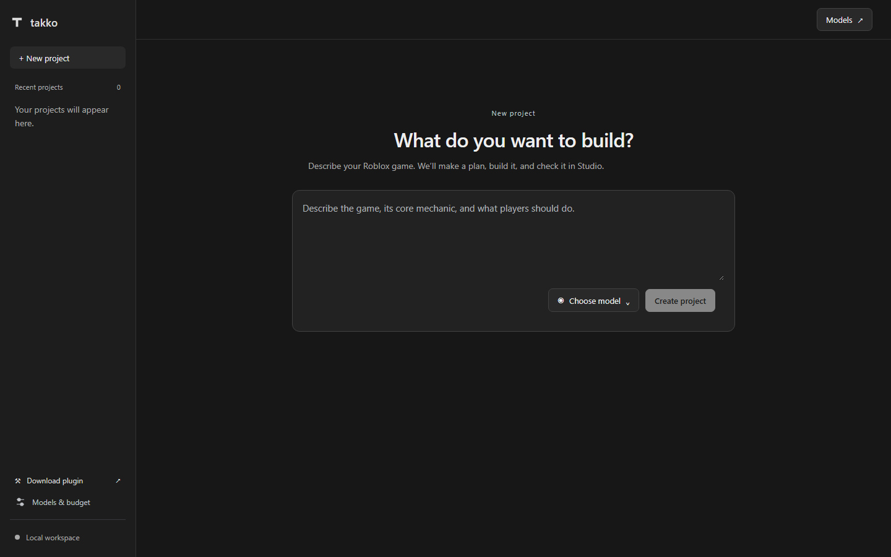

# Minimal UI and generation integrity

The user's priority is reliable game generation. This slice simplifies the interface and fixes specific ways the generation pipeline could corrupt earlier work or mis-handle repair evidence.

## Interface

Forge now uses a compact dark interface with system fonts, a project list and a single prompt area. The project workspace exposes Brief, Build, Source and Studio directly. The decorative graph, Explore view and oversized promotional layout are removed. Task dependencies, source shortcuts, model configuration, follow-up requests and history remain available through ordinary lists and tabs.

The user supplied Interview Coder as a style reference. This uses its general compact utility-app direction; Forge's controls continue to serve Roblox development. No Interview Coder implementation or special desktop behavior was copied.

## Generation changes

### Preserve earlier scene work

Before: task A could create an anchored 40×1×40 ground part. Task B could return the same path with only a color property. Whole-node merging silently removed the original size and anchored state, and static validation still passed.

Now: builder tasks cannot change a scene node emitted by an earlier completed task. Identical declarations and new descendants remain valid; changed existing nodes receive correction feedback naming the path. Explicit repair remains the route for changing existing implementation. This does not determine whether an unchanged scene is a good design.

### Compile before saving task completion

Generated task scripts now compile before they become saved dependencies for subsequent tasks. Syntax errors go back to the current builder's bounded correction loop. If correction fails, the task stays incomplete and its invalid code never enters downstream context. Final whole-artifact and acceptance-test compilation remain separate checks.

### Keep acceptance tests identifiable and extensible

Duplicate test IDs and unknown requirement references are rejected before tests become protected. Previously duplicate names could pass review validation but become ambiguous ModuleScripts and invalid Studio receipts. New unique regression scenarios now survive review merging even when another test already covers their requirement. Protected test IDs keep their original content. Exceeding the 40-test limit produces an explicit correction instead of silently dropping tests.

This validates identities and catalog integrity. The assertion-presence heuristic does not establish that a test is meaningful, and a compiled test has not necessarily run.

### Reject unchanged repairs

An empty patch or an exact repeat of the existing artifact cannot clear reported failures through another review. The engine requests a corrected response before invoking a further reviewer; if both attempts fail, the original artifact, protected tests and Studio failure evidence remain available.

The comparison ignores object-property ordering. It allows real changes to files, scene nodes, asset metadata or coverage. It does not prove that a changed patch fixes the game. After a changed patch passes static checks, Studio verification is still pending.

## Evidence and limits

Regression tests exercise the actual engine with deterministic provider fixtures. Repair cases and existing compilation regressions use the real local Luau compiler. Task sequencing and review-catalog tests inject compiler results to isolate checkpoint and validation behavior. They reproduce and check the specific failure cases above; they are not a model-quality benchmark. Browser screenshots use the isolated test workspace.

Fresh native Studio discovery returned no connected instances. No new Studio apply/playtest, paid model generation, live server restart or existing-place mutation occurred. The packaged desktop app uses its separate project store. These improvements remove concrete failure modes; end-to-end gameplay quality still needs real generation and Studio scenario verification.

Final `npm run check` passed: **166 unit/API tests, nine desktop tests, 34 browser cases**, and all offline Luau, plugin, guard, build and production smoke stages. The separate hidden native Electron smoke passed. The unsigned Windows package was regenerated with matching resource hashes; see [package verification](results/desktop-package-verification.json).

