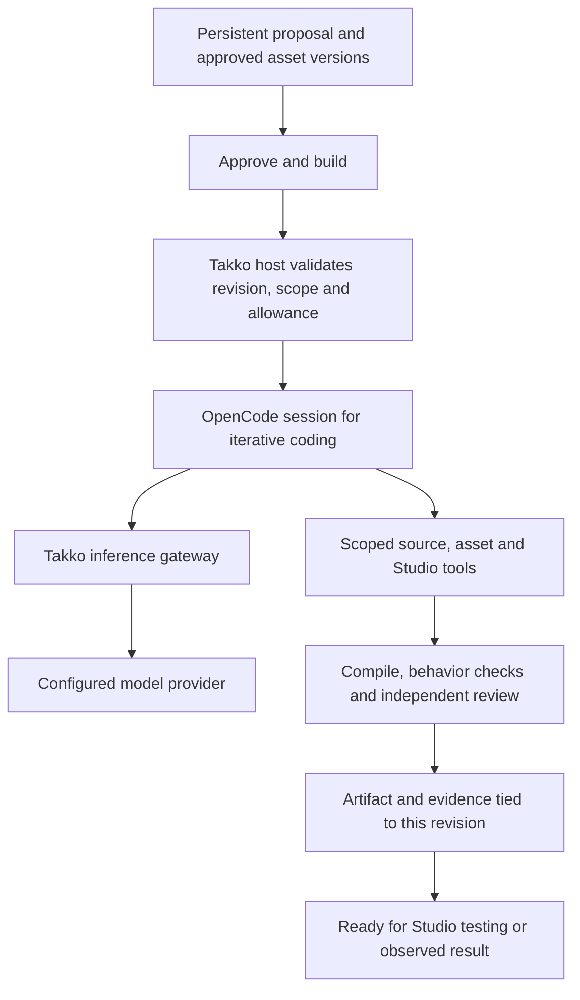

# OpenCode and competitor reuse re-evaluation

2026-09-24 UTC. Research, source inspection and replay of saved offline evaluations. No new inference, product implementation, app restart or Studio session.

## Decision

Recommend adopting OpenCode as the first replacement candidate for Takko's custom inner coding loop. Retain the user-facing proposal, asset review, cumulative accounting and Studio evidence boundaries as product requirements. Do not assume the current engine deserves preservation simply because it exists.

This is a recommendation to integrate and evaluate a concrete replacement, not proof of compatibility or a completed migration. The existing engine should remain available as a comparison and rollback path until the replacement meets the gates below. Avoid placing OpenCode inside every current worker while retaining all existing paid planning and review stages. That could add a second agent loop without removing the first loop's overhead.

The approved product flow stays: prompt, persistent proposal covering mechanics/theme/environment/assets, optional surgical edits or replacements, then one Approve & build action. No new customer approval stages are proposed.

## Correction to the earlier assessment

The repository already contains an actual OpenCode comparison. It should have been incorporated before asserting that Takko's system was better. [Research report 24](../research/24-agent-effectiveness-comparison.md) explicitly supersedes the earlier presumption in report 23 that the custom core should be retained.

In the September 16 pilot, both systems received three authored pure-Luau tasks and the same public assertions, using GPT-4.1 mini. OpenCode 1.18.31 ran as an actual external CLI. Takko used its builder/reviewer workflow. Their tool affordances differed, so this was a configured-system comparison, not an isolated agent-loop ablation.

| Recorded result | Takko | OpenCode |
|---|---:|---:|
| Logic tasks passed | 3/3 | 3/3 |
| Provider calls | 6 | 14 |
| Total model cost | $0.0243528 | $0.0156412 |
| Mean elapsed per task | 9.28 seconds | 25.06 seconds |
| Input tokens | 50,062 | 82,855 |
| Cached input tokens | 1,920 | 72,576 |

OpenCode was 35.8% cheaper and about 2.7 times slower in that small trial. It used more calls and more input tokens. Cache billing explains the observed cost advantage, but the experiment did not isolate why cache reuse differed. One run per task with public tests does not establish generalized superiority, native gameplay, Marketplace integration or today's full-game cost.

This session copied the preserved evidence into a new results directory, reran all six saved Luau evaluations, and reconciled all 20 historical provider receipts. All six evaluations passed. No inference was replayed. The historical $0.039994 total is not new spending. The 92 non-verification files in the copy match the originals byte-for-byte. The verifier wrote only to the new copy. [Replay verification](../research/results/opencode-reevaluation-20260924/agent-effectiveness-v1/verification.json).

Takko also already tested a lossless context reorder, recording a 14.6% cost reduction in another small pilot. Do not present stable-prefix ordering as an unimplemented new discovery. That existing result does not solve the current excessive planning output. [Prior context experiment](https://github.com/Jarvuslin/takko-project/blob/4622b0f/docs/takko-context-and-media-fixes.md).

## What to borrow, in priority order

| Source | Observed mechanism | Recommended application | Boundary |
|---|---|---|---|
| OpenCode | Persistent agent sessions, tool execution, streaming progress, cancellation, compaction and provider-aware caching. Inspected pinned implementation. | Replace the custom iterative coding/repair loop through a versioned adapter. Give the agent actual source, bounded tools and test results. | Keep money admission and artifact approval outside its prompts. Compaction and retries can themselves cost money. |
| BloxBot | Built-in Explorer/Studio discovery programs, compiled artifact reuse, polling backoff, compact Studio instructions and OpenCode SDK integration. Inspected source. | Use deterministic inspection and explicit Studio identity. Borrow the process/SDK integration shape instead of rebuilding a generic agent host. | Its model-generated recovery, dynamic program execution and target forwarding need adaptation to Takko's constraints. Do not copy them blindly. |
| Superbullet | Public component packages declare dependencies, media, versions and installation instructions. Retained 0.3.99 source shows instructions returning to the agent after import. | Build a reusable component contract and integration-test library. Generate the missing connections and customization instead of rewriting every common system. | Reuse the design, not proprietary packages. Imported instructions remain untrusted data. Avoid combat-specific prompt branches or fixed asset IDs. |
| Aider | Cached, token-bounded repository maps rank definitions and references. Re-read the retained implementation. | Give workers a compact Luau interface/dependency map, then load source on demand. | Existing Python parsing/ranking is not a drop-in Luau/Studio integration. Start with Takko's task/file graph and validate retrieval coverage. |
| Cline | Explicit tool-output caps and repeated-call signature tracking with warning/stop outcomes. Re-read retained implementation. | Bound evidence returned to the agent, preserve full output behind retrievable references, stop repeated no-progress actions. | A limit must not silently delete requirements or vital errors. Check existing OpenCode controls before duplicating them. |
| Lemonade | Provider-attributed usage includes economical models. Its full backend routing is unavailable. | Evaluate cheaper coding workers with stronger escalation only for demonstrated failures. | No evidence supports copying an exact private routing policy or claiming a price per working game. Jev remains non-coding. |
| ForgeGUI.com | Retained public client separates routing/dispatch and exposes reference/context-library and specialized media operations. | Retrieve relevant examples and media evidence per task. Use dedicated asset operations where useful. | Client interfaces do not establish retrieval quality, proprietary weights or backend cost. |
| RoCode and similar Studio assistants | Publicly advertise targeted edits and undo. This is product documentation, not inspected backend code. | Keep small changes and understandable recovery central to the experience. | This is an expected capability, not a unique Takko advantage or a ready-made implementation to copy. |

Sources: [OpenCode SDK](https://opencode.ai/docs/sdk/), [BloxBot Explorer](https://github.com/paralov/app-bloxbot-ai/blob/8a0c1b9d53916171e116c3d79cd943f858c9bdce/src/components/Explorer.tsx), [Superbullet package contract](https://marketplace-docs.superbulletstudios.com/how-to-add-asset), [dependency behavior](https://marketplace-docs.superbulletstudios.com/relevant-systems-prompts), [extension contracts](https://marketplace-docs.superbulletstudios.com/extensions), [Aider map](https://github.com/Aider-AI/aider/blob/5dc9490bb35f9729ef2c95d00a19ccd30c26339c/aider/repomap.py), [Cline output limits](https://github.com/cline/cline/blob/82b8e1fa0471f728e3d9540fd19aa063e2049497/sdk/packages/core/src/extensions/tools/executors/output-limits.ts), [Cline loop detection](https://github.com/cline/cline/blob/82b8e1fa0471f728e3d9540fd19aa063e2049497/sdk/packages/core/src/runtime/safety/loop-detection.ts), [Lemonade attribution](https://openrouter.ai/apps/lemonade), [dated ForgeGUI inspection](../research/25-next-models-lemonade-forgegui.md), [RoCode](https://www.rocode.app/).

No third-party implementation was copied into Takko. OpenCode and BloxBot roots contain MIT license notices. Record applicable file/dependency notices when selecting code for an implementation. No closed-source competitor code or package is proposed for transplantation.

## Proposed integration boundary

OpenCode would own the reasoning/tool iteration. Takko would own the product's authoritative records, dispatch authorization and interpretation of results. The initial adapter should support an approved build and later scoped repair in an isolated generated-project workspace. Keep the agent out of Takko's application repository, stored credentials and immutable evaluator files.

Retain a durable mapping between Takko project/revision/job and OpenCode session/message IDs. Restart or cancellation must reconcile unfinished requests before another call. A session summary is a context aid, not the canonical proposal, selected asset manifest, acceptance criteria or billing ledger.

Prefer a local server/SDK boundary over copying OpenCode's internal service graph into Takko. Pin a tested binary and SDK combination. BloxBot's lockfile uses SDK 1.18.4 while its downloader chooses compatible 1.x runtime releases. That does not establish the actual binary used by any BloxBot user or guarantee compatibility with our pinned 1.18.31 inspection.

The existing [comparison harness](<D:/RobloxProjects/Roblox Gen/scripts/compare-agent-effectiveness.ts:204>) already demonstrates a limited OpenCode-to-Takko-controlled-proxy path. It used a dummy local credential and retained liabilities before dispatch. It is a research starting point, not a production adapter. Its single-provider protocol, sequential active-trial accounting and buffered responses need replacement with durable per-request/session accounting and streaming before concurrent production use.

## Compatibility findings that matter

### Spending and credentials

OpenCode's request preparation exposes parameter/header hooks, and the processor records usage after model steps. Neither is a substitute for a durable gateway that checks the entire cumulative allowance before every upstream request. Route main, compaction, title/helper, retries and any delegated calls through that gateway. Count them under the same Takko generation and project limits. Do not reset spending on a new session or edited proposal.

The inspected retry policy permits up to five retries for eligible errors. A configured agent step limit is also not a monetary cap. Cancellation cannot erase a dispatched call's liability. Unknown usage must retain the reservation. A budget denial should latch the job closed and stop the session so runtime retries cannot create additional provider requests.

OpenCode's default auth implementation writes provider credentials to `auth.json`. Takko's explicit encrypted-storage requirement therefore rules out simply sending real provider keys through the ordinary auth-save path. Keep the real keys in Takko's DPAPI-backed host and give the runtime only a restricted local gateway credential. Supplying a custom provider is feasible in the existing pilot. Full native OpenAI/Anthropic/Gemini protocol and media parity remains untested and must not be silently assumed from the OpenRouter-compatible pilot.

Sources: [request hooks](https://github.com/anomalyco/opencode/blob/014614d35b397775e5d397a490fc72368c894ec2/packages/opencode/src/session/llm/request.ts#L114), [retry policy](https://github.com/anomalyco/opencode/blob/014614d35b397775e5d397a490fc72368c894ec2/packages/opencode/src/session/retry.ts#L30), [auth storage](https://github.com/anomalyco/opencode/blob/014614d35b397775e5d397a490fc72368c894ec2/packages/opencode/src/auth/index.ts#L81).

### Context and completed work

OpenCode implements provider-specific caching and recent-context preservation during compaction. Compaction is a model call, and summaries can lose detail. Rehydrate the approved requirement/asset manifest and current failure evidence by identity. Never infer that a summarized-away requirement has been removed. Keep completed artifacts and worker receipts in Takko's store across session changes.

BloxBot's ordinary Explorer refresh runs a built-in or cached collector without inference. Model repair is a fallback. For Takko, deterministic recovery and a clearly bounded model-assisted repair can preserve that economy. Avoid granting generated host-side TypeScript arbitrary capabilities merely to save refresh calls.

Sources: [caching implementation](https://github.com/anomalyco/opencode/blob/014614d35b397775e5d397a490fc72368c894ec2/packages/opencode/src/provider/transform.ts#L358), [compaction path](https://github.com/anomalyco/opencode/blob/014614d35b397775e5d397a490fc72368c894ec2/packages/opencode/src/session/compaction.ts#L356), [BloxBot runtime](https://github.com/paralov/app-bloxbot-ai/blob/8a0c1b9d53916171e116c3d79cd943f858c9bdce/electron/services/GeneratedProgramRuntime.ts#L69).

### Studio effects and verification

OpenCode's snapshot implementation uses filesystem/Git state. It does not roll back Roblox instances changed through MCP. Keep explicit Studio identity, owned scope, precondition hashes, operation receipts and native undo/staging behavior. The host must enforce these before mutation instead of trusting a system prompt to do so. Route playtests through the same target validation as edits.

BloxBot's broker forwards native tools, and its normal chat supplies the selected Studio reference. Its playtest panel omits that explicit field. This is a source-level gap, not a reproduced wrong-place failure, and it is a reason to place target binding in the host tool path rather than only the chat component.

An agent may run checks and propose repairs. It must not rewrite protected acceptance criteria or label its own successful tool return as verified gameplay. Keep observed input, scene state, logs, media playback and result identity separate from model statements. A failed edit leaves the previous proposal and artifact intact.

Sources: [OpenCode snapshots](https://github.com/anomalyco/opencode/blob/014614d35b397775e5d397a490fc72368c894ec2/packages/opencode/src/snapshot/index.ts#L71), [BloxBot source comparison](https://github.com/Jarvuslin/takko-project/blob/4622b0f/docs/bloxbot-source-comparison.md), [Takko plugin](<D:/RobloxProjects/Roblox Gen/plugin/Forge.plugin.luau:94>).

## Changes to prioritize and changes to avoid

1. Replace the custom coding loop through an adapter. Remove routine paid next-action scheduling from that path. Preserve exact intent and receipts rather than retaining every internal abstraction.
2. Use compact plans with interfaces, owned files, relevant assets and acceptance behaviors. Do not generate verbose independent plans for every area before trying any implementation. Avoid blindly lowering output limits, which already caused truncation failures.
3. Run deterministic checks before paid diagnosis. Group independent review by changed systems plus an integration check, with full requirement coverage. Invalidate consumers when shared contracts, media or dependencies change. This is our proposal, not a claimed competitor implementation.
4. Add reusable component contracts covering provenance/version, dependencies, lifecycle, server authority, media permissions and native acceptance tests. The fighting case exercises them but must not define special-case product logic.
5. Evaluate cheaper models on the same tools and tasks. Escalate only when the cheaper route fails a meaningful criterion. Keep Jev on bounded non-coding decisions.

Avoid a new swarm of agents, another generic model-provider UI, a large vector database before retrieval needs are measured, automatically regenerating all plans on edits, or a promise of a fixed cost per game before observed completion data exists. OpenCode does not automatically make expensive output, bad asset selection or unsupported media disappear.

## Small integration test that can settle the recommendation

These are proposed implementation and evaluation gates, not tests completed this session and not authorization for inference.

First build the adapter against a fake provider and mocked Studio tools. Verify every provider request reaches the cumulative gateway, including helper calls, retries and compaction. Verify failure/cancellation/restart keep reservations and completed work. Enforce proposal identity, file ownership and Studio target at the host boundary. Fail closed on unsupported provider protocols. Confirm no real key reaches runtime auth files and the current app remains untouched. Run `npm run check` after implementation.

Then, with authorization for a specifically capped run, compare the current pipeline and OpenCode-backed pipeline on the fighting benchmark plus unrelated traversal and interaction tasks. Freeze the user-visible requirements and independent behavioral checks. Include Marketplace assets, animation/audio/VFX permissions, respawn, multiplayer authority and surgical edits. Count all failed calls, repair time and human intervention. Report first-pass and final completion separately. Existing pure-Luau successes are screening evidence only.

Adopt the new path if it preserves the required flow and spending protections while improving accepted-result cost or completion without unacceptable latency. Retain or revise it if the same failures persist. Do not treat the sunk cost of Takko's engine as a reason to reject the replacement, or OpenCode's popularity as proof it will succeed.

## Evidence and work performed

Primary OpenCode inspection: release 1.18.31 at `014614d35b397775e5d397a490fc72368c894ec2`, matching the earlier trial's version. Also retained an initial 1.18.4 clone at `49c69c5ed3ccf706b61b3febb43c8aaff7f8325e`, selected from BloxBot's SDK version before distinguishing SDK from runtime. Both snapshots remain untouched. BloxBot inspection remains commit `8a0c1b9d53916171e116c3d79cd943f858c9bdce`.

Re-read dated Cline/Aider source and existing Superbullet/ForgeGUI evidence. Freshly read official OpenCode, Superbullet, Lemonade attribution and RoCode pages. No unavailable competitor backend is claimed to have been inspected. [Source hashes and evidence-copy manifest](../research/results/opencode-reevaluation-20260924/source-manifest.json) records 23 inspected OpenCode/BloxBot files and 92 matching copied evidence files.

Passed this session: six saved pure-Luau evaluations, reconciliation of 20 historical receipts and matching copied evidence. No new model-generation result. Neither OpenCode's nor BloxBot's own test suite was executed. `npm run check` was not run because product code/configuration did not change. Native Studio gameplay was not tested. Initial reads raced an unfinished clone and several source-path searches needed correction. Public Superbullet `/docs` guesses failed before the actual documented Marketplace URLs were used. Those investigation failures are not product failures.

No paid calls, competitor runtime launch, application restart or Studio session. The business viability review remains open pending customer-demand evidence. This technical recommendation does not pretend to complete office-hours or plan-ceo-review, and it does not reopen the approved proposal-flow design.

At 2026-09-24T16:50Z no listeners were found on 4318, 4319, 4324, 4335 or 4336. Studio PIDs 3088 and 6604 remain present. Studio mode was not inspected or changed. New paid cost is $0. Historical accounted spend remains $3.990954 of $4.40, including unknown holds, with $0.409046 remaining authorization. Last provider balance remains $1.263503974 at 2026-09-24T03:32:45.775Z, not refreshed. Failed fighting project e4689e81-9de2-4d7d-b958-c904194f6a44 remains untouched. No budget or paused generation was changed.
