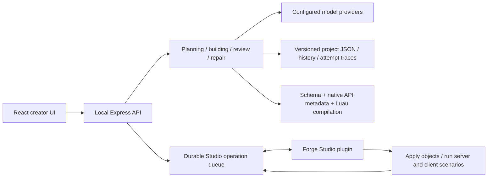

# Forge release assessment — 2026-09-14

Subsequent work: [Research-backed planning and stronger-model comparisons](research-and-model-pilot.md). A real research stage and independent lead routing now address mistaken reference-game briefs. Latest offline check passes 128 unit and 28 browser cases plus the other stages. Native release gates below remain open.

**Release decision: not production ready.** Forge has a real local backend and demonstrated native Studio integrations. Those facts establish a working prototype, not a dependable general game-generation product. The previous successful Cookie Clicker run was a narrow result; the user's next project exposed additional contract failures immediately.

## What runs today

The server binds to 127.0.0.1:4318. It checks Host/Origin, keeps provider keys in memory, saves configuration and projects, reserves and records model spending, validates output, enforces script ownership and namespaces, and sends bounded operations to a pairing-protected Studio bridge. It is a single-user local system. It has no hosted accounts, tenant authorization, subscription billing, cloud workers, or deployed service infrastructure.

## Root cause of the reported class failure

Project `ed0ef911-5a33-4cbd-a9f2-0ff37392b996`, approved revision 4, requested a cookie Part with Texture. Its builder returned the real Roblox `Texture` class. Forge's hand-maintained 45-class enum omitted that class, so both the original response and correction were rejected. The browser showed the raw enum error instead of the offending node and a useful explanation.

The same saved response also contained a fabricated image asset ID, an invalid enum descriptor, and empty scene-only coverage. Simply adding Texture would therefore have exposed another failure. The model later claimed a different invented texture ID had been supplied by the user. Neither ID appears in the request or answers. More budget does not solve missing product context or assets.

## Changes delivered in this pass

- Replaced the hand-maintained class enum with a reproducible catalog derived from the installed Studio's ReflectionService: 302 non-deprecated, creatable, serialized, non-service class names after excluding script classes (scripts retain their separate source contract). Snapshot Studio version: 0.738.0.7381393. Added per-class writable property/type metadata and 130 referenced enums. This is API metadata evidence, not proof that all 302 classes render correctly in every parent context.
- Added property/type and enum validation before task checkpoints. The builder now receives all structural, coverage and asset errors for its candidate task; invalid output is not marked complete and saved as an accepted dependency.
- Added concise failures with task, phase, attempt count, and expandable diagnostics. Kept append-only model-attempt traces alongside the latest-response file. Fallback routes receive the preceding validation feedback instead of starting without it.
- Added an installed-content catalog covering 9,189 image, audio, mesh and font paths. References are checked even when omitted from the model's asset declarations. This catches invented built-in paths such as `rbxasset://textures/ui/Cookie.png` and `rbxasset://sounds/click.wav`. The catalog proves local file existence, not visual or audio suitability. Empty provider completions now use configured fallbacks while retaining billing, as truncated completions already did.
- Added a `needs_input` outcome for declared missing assets and non-audio asset IDs falsely marked user-provided. The draft is not accepted, corrections are not repeatedly purchased, and further generation is blocked until the brief is updated and replanned. Scene coverage explicitly requires real object paths.
- Persisted bridge pairing, sessions, queued operations and result acknowledgments with atomic replacement. Reconstruction retains operation identity and accepts a result only once. Test evidence is saved before acknowledgment. Provider keys remain session-only; this does not add secret-key persistence.
- Added an independent capability fixture covering Texture, Decal, ClickDetector, ScrollingFrame, TextBox, UIGridLayout, UIScale and UIAspectRatioConstraint for native verification. Its manifest and scripts validate offline. A new native launch was blocked by automatic approval review; no new runtime pass is claimed for this fixture.

Sources: [Roblox ReflectionService](https://create.roblox.com/docs/reference/engine/classes/ReflectionService), [Roblox decal face example](https://create.roblox.com/docs/reference/engine/classes/Decal/Texture). The local source snapshot and derived catalog are distinct from Lemonade's shipped plugin or unavailable backend. No Lemonade plugin changes were made.

## Verification and limits

The complete `npm run check` covers 119 unit tests, six offline Luau gameplay scenarios, six plugin mock scenarios, guard mutation checks, TypeScript/Vite build, production HTTP smoke, and 24 desktop/mobile browser tests. New regressions cover the reported class family, invalid properties/enum values, task correction before checkpointing, missing-asset stopping, invented built-in files, empty completion fallback, durable operation recovery/idempotency, and readable browser diagnostics.

The live retry progressed through all five builder tasks, then its reviewer returned no usable text. Inspection caught the invented built-in image and sound paths that the model had substituted after its invented uploaded ID was rejected. These defects motivated the asset-catalog and empty-completion fixes above. The saved build was revalidated without a model call or gameplay edit and is now `needs_input`, with both missing files explicitly recorded. This game has **not** passed review or native runtime verification. Its total recorded spend is $0.038546 under the $1 cap. The browser was refreshed and the concise blocked status was observed. See [the final project diagnostic record](results/scene-contract-recovery.json).

The native ReflectionService metadata capture succeeded. It does not exercise gameplay or exporter fidelity. The previous project's eight model tests and independent click/upgrade/HUD audit remain valid historical evidence; they must not be presented as a pass for this different project or the new capability fixture. No Studio MCP session was available in this pass. Automatic approval review rejected a command to install the temporary fixture driver and launch another Studio test, with only “blocked by policy” supplied as the reason.

The live server was reloaded while idle without discarding its in-memory model keys. Prototype hot reload through the inspector is a development workaround, not a release/update mechanism. Native helper plugin source was restored to the normal plugin after the metadata capture.

## Release gates still open

| Area | Required before calling the local app production ready |
|---|---|
| Generation reliability | A repeatable multi-genre corpus, fixed budgets, success/failure rates, independent behavioral oracles, and failure triage. One successful prompt is insufficient. |
| Capability compatibility | Native apply **and export/import** tests for supported property types, constraints and hierarchy; explicit Studio/plugin compatibility checks and controlled snapshot updates. |
| Asset resolution | Real search/import/provenance and permission handling, clear missing-asset UX, and no invented IDs. Procedural alternatives must match the user's accepted brief. |
| Durable recovery | Crash/power-loss and corruption recovery tests, backups and migration policy, bounds/retention for traces and queues, single-server ownership of the data directory. The bridge reconstruction regression covers only part of this. |
| Model adapter contracts | Provider capability negotiation, schema-constrained output where supported, retry/backoff policies, refusal/truncation handling and validated output size limits. Current JSON mode plus application validation is not a universal strict structured-output guarantee. |
| Packaging and updates | A supported installer, signed/versioned plugin distribution, process supervision, supported runtime versions, upgrade/rollback tests, and an explicit key-storage choice. |
| Runtime quality | Mouse/touch interaction, respawn and leave/rejoin, simultaneous clients, audio/animation and visual inspections against the requested experience. Generated `assert` calls alone are weak evidence. |
| Generated-code trust | Define and enforce the execution trust boundary. Manifest namespace validation and Luau syntax compilation do not sandbox arbitrary generated scripts or prove their API behavior safe. |
| Operations | Reproducible remote CI, release artifacts, structured operational diagnostics and a tested support/incident workflow. CI files exist locally, but no remote repository is configured. |
| Hosted service, if selected | Accounts/tenant isolation, secure credential storage, database/job workers, authenticated Studio relay, HTTPS/domain/deployment, rate limits, billing and operational monitoring. These are a different architecture from the current localhost app. |

The user was asked whether the production target is local or hosted. Until answered, local hardening is the working assumption; no hosted deployment or account system has been invented. The user was also asked whether to supply a cookie texture ID or approve a procedural appearance. That choice is needed to complete the currently blocked design faithfully.

An intermittent Windows Vitest worker termination (3221226505 in API tests) occurred in an earlier final-check attempt. API cleanup now closes its HTTP server gracefully instead of forcibly destroying connections. The subsequent complete run passed; this single result does not establish the platform crash's root cause or long-term absence.
