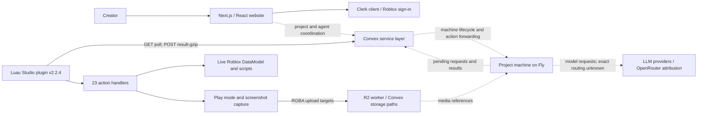
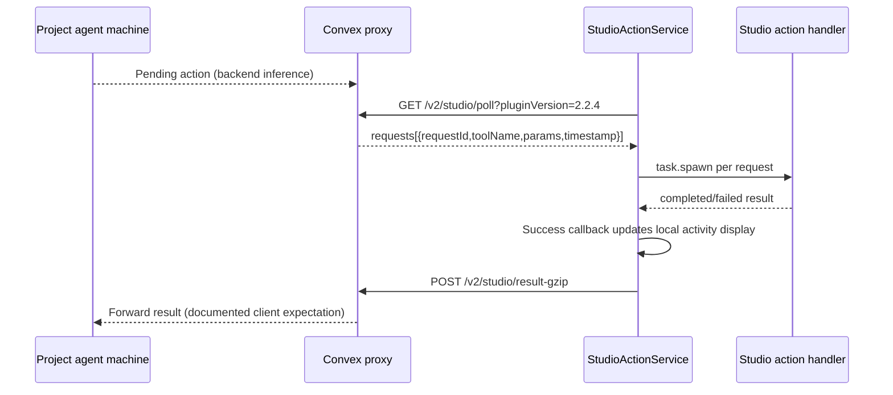

# Architecture reconstructed from available evidence

## Current system

Solid relationships below are visible in shipped code or public client assets. Dashed relationships describe backend behavior inferred from protocol comments or public provider attribution; the server implementation has not been inspected.

### Web client

Public routes ship Next.js App Router/React bundles under `/_next/static/chunks/`. The page includes Clerk's browser client at `clerk.lemonade.gg` and a Roblox sign-in flow. Public bundles use utility CSS classes, animation code, and accessible component primitives. These observations identify client technology, not the full application dependency versions or server deployment vendor. A `dpl_...` asset parameter alone is not enough to claim the exact hosting topology.

The downloaded `code.html` is the unauthenticated response; its contents resolve to sign-in. The formatted `bundle-24-page-17a00f510a4596cb.js` is sign-in code, **not the private project editor**.

### Plugin composition

| Module area | Responsibility | Evidence |
|---|---|---|
| App | Fusion UI, connect/disconnect, onboarding, project status, settings/error views | `001-App.luau`, `041-Connected.luau`, `048-Welcome.luau` |
| Core | Build tree/processors/watcher, load project details, begin action polling, stop/cleanup | `055-Core.luau` |
| Net | HTTP requests, encoding/gzip, project lookup, machine status, binary uploads | `128-HttpCore.luau`, `129-ProjectApi.luau` |
| StudioActionService | Poll queue, dispatch handlers, report completion/results | `135-StudioActionService.luau` |
| StudioActions | Explicit registry of 23 agent-facing methods | `061-StudioActions.luau` |
| Tree/Watcher | Bidirectional instance/ID maps, persistent attributes, discovery, duplicate repair | `108-Tree.luau`, `142-Watcher.luau` |
| DOM/property conversion | Roblox reflection database, encoded values, attribute/property round trips | `110-Dom.luau`, `114-database.luau`, `101-PropertyConverter.luau` |
| Visual execution | Play-session setup, client/server logs, capture readiness, image rendering/upload | `085-playtest.luau`, `065-capturePlaytestScreenshot.luau`, `089-renderContentId.luau` |
| Older sync machinery | Snapshot hydration/diff/write helpers and conflict UI | `058-Processor.luau`, `096-Write.luau`, `040-ConflictResolution.luau` |

Dependencies include Fusion, Promise, Signal, hashlib, and TestEZ, as recorded by the manifest. The extracted asset includes test sources; those being shipped does not establish that they pass or are run in release CI.

## Connection lifecycle

1. `App:connect` warms the CDN permission path and calls the plugin-version compatibility endpoint.
2. `ProjectApi.currentProject` identifies the active browser project associated with the Studio user. The UI tells users to use the same Roblox account on both sides.
3. The plugin saves `PROJECT_ID`, constructs a new `Core`, and calls the project machine ping endpoint to trigger Fly autostart.
4. It waits two seconds, then checks machine readiness up to 60 times, with two-second delays on not-ready responses. **The elapsed bound is not exactly two minutes**, because HTTP durations add to those waits. A status-check transport error exits the loop and leads to an error view.
5. `Core:run` registers standard services, walks existing instances, tags IDs, starts the watcher, and triggers initial script permission setup.
6. The action polling loop begins. The app starts separate current-project monitoring at a 30-second interval.

References: `001-App.luau:381`, `001-App.luau:668`, `055-Core.luau:108`, `055-Core.luau:309`.

## Tool-call round trip

Polling starts at one second. After 20 consecutive empty polls, the interval grows toward five seconds; activity resets it. The source explicitly associates this with reducing Convex concurrent-action saturation. Whether the server itself holds requests open is not known; do not equate the one-second sleep with measured end-to-end latency.

Requests carry `X-User-Id`; Studio action calls also carry `X-Project-Id`. `CLIENT_ID` is generated and persisted, but is not automatically included by the inspected `request` function. The server's authorization, pairing, tenancy checks, leases, deduplication, and request queue retention are unknown. Header presence alone does not establish an authentication vulnerability.

## State and identity

`Tree` maintains `instanceMap`, `idMap`, metadata, and timestamps. It stamps `_lemonadeUniqueId` attributes. Services have canonical IDs such as `ws1`, `sss`, and `rs1`. Existing objects are indexed on connection; duplicate IDs are repaired. A failed ID-map lookup can scan descendants across tracked services and self-heal.

The current watcher is explicitly an **ID tagger**, not continuous full bidirectional code synchronization. It observes descendants being added. This distinction matters when designing context freshness: an agent may need live reads to observe later source/property edits. There is no evidence here that the backend lacks its own cache invalidation or retrieval logic.

## Playtesting and media

The newer `playtest` uses `StudioTestService:ExecutePlayModeAsync`, injects helper scripts/channels, records server/client logs, and can capture multiple frames. `capturePlaytestScreenshot` runs a dedicated visual test. `captureScreenshot` has an edit-mode template path that patches UI code to render in CoreGui. Those are different validation environments.

The visual subsystem already contains health probes for paused rendering and a wedged capture pipeline, readiness windows, sequential capture retries, deadlines, and a device-simulator lock for dedicated screenshot paths. These fixes should be retained and measured, not rediscovered as missing features.

Frames can travel as inline base64 RGBA, sequential tiles, binary POST to Convex storage, or binary PUT through an R2 worker. The preferred R2 branch does **not** fall back to Convex on per-frame upload failure, despite an older type comment saying it does. It drops the frame and returns available references. The implementation later in `085-playtest.luau:899` is the stronger evidence.

## What cannot be reconstructed yet

The system prompt, planning algorithm, context compaction, model selection by task/tier, template catalog, asset search/ranking, credit calculation, project database schema, retry policy in the VM, and actual feedback-loop stopping criteria are unavailable. OpenRouter attributes traffic to Lemonade across multiple models; this does not disclose which model generated the user's failed game, or whether routing changed during that run.

Lemonade's [privacy page](https://lemonade.gg/privacy-policy) states that it does not host/store project files or the codebase. Plugin source shows transport of source/tool results and optional screenshot storage. Those facts can coexist with transient processing; persistence and retention require server-side confirmation. Older unused methods such as `setProjectStructureFast` are not proof of current permanent code storage.
