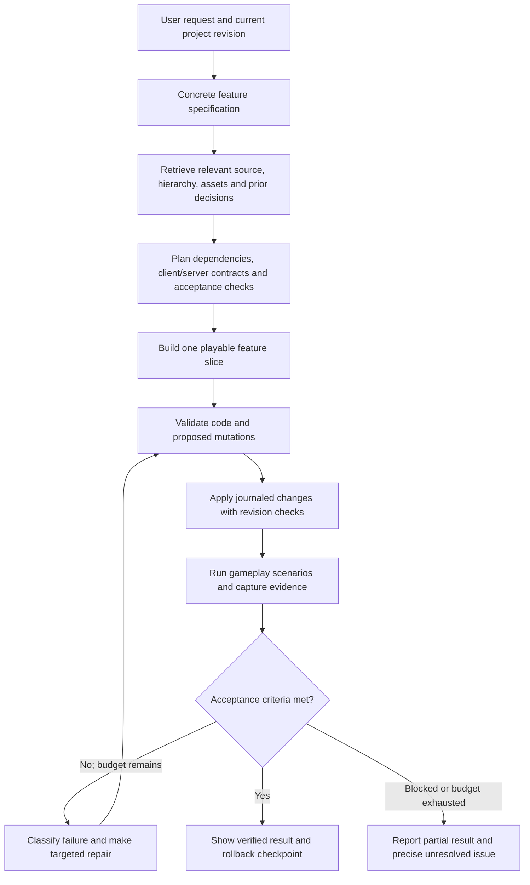

# Improving generation and planning the later implementation

**Follow-up scope:** the user now specifically wants to improve the existing inexpensive models. See [the same-model design](07-cheap-model-quality.md) and [cost/parity experiments](08-cost-and-parity-experiments.md). Stronger online routing below is an earlier comparison idea, not the default proposal for the current request. The new design allows offline expert work but does not require an Astra call per generation.

## Primary objective

Optimize **verified feature completion per dollar and per minute**. Token throughput, script count, and attractive screenshots are supporting signals; they are not the product outcome.

A stronger model may help, but the available evidence does not justify saying GPT Astra alone solves this product. Evaluate the model actually available to the team under a fixed tool/context/validation contract, then compare routing policies on the same tasks. Codex model availability in this session is not proof of an identical public API product, price, or deployment configuration.

## Proposed generation loop

This specifies required behavior; it does not claim the current agent lacks every stage.

### Specify the game before producing bulk code

Translate the prompt into a compact schema: genre, core loop, controls, player count, world layout, visual direction, economy/persistence, named features, and measurable acceptance criteria. Reconcile requirements with the existing project. Use sensible defaults for low-impact design choices and ask only about material ambiguities.

A request for a shop becomes: item catalog, server-authoritative balance, purchase endpoint, ownership representation, UI states, failure handling, persistence policy, and tests. This gives the agent concrete completion criteria and avoids an impressive-looking menu with no working purchase behavior.

### Use a reusable gameplay foundation

Maintain versioned, tested building blocks for rounds, checkpoints, inventories, shops, persistence, spawning, UI navigation, and client/server messaging. Compose explicit interfaces rather than making the model repeatedly improvise the same infrastructure.

For world generation, use a scene/layout representation with spatial constraints, asset tags, scale/collision budgets, spawn paths, and gameplay affordances. Asset retrieval should score functional fit and visual consistency, then validate bounds/collisions. Importing arbitrary assets is not equivalent to constructing a coherent playable map.

Keep original art direction in a project design document: palette, typography, silhouettes, density, camera, lighting, feedback animations, and UI components. Evaluate whether the generated scene follows it at actual device dimensions.

### Make memory explicit and source-grounded

Persist game requirements, architectural decisions, accepted interfaces, failing/passing tests, known limitations, and source revisions. Build context from the dependency graph and current state. Summaries should link back to exact script/instance IDs and revisions; they must not overwrite the live project as the source of truth.

Track `feature -> modules -> instances -> remotes -> assertions` so a request to modify one system retrieves dependent pieces. Log whether each relevant file was in context. That allows distinguishing insufficient reasoning from missing information.

### Route models based on measured needs

The public OpenRouter page observed on 2026-09-13 lists GPT-5.6 Luna as the largest displayed monthly model usage, alongside Hy3, Gemini 3.7 Flash, Ox Alpha and others. Token shares are not request shares, quality, costs, or the selected model for this project.

Compare: the current policy; a stronger model throughout; a stronger planner/reviewer with the current executor; and escalation only on failed acceptance checks. Keep budgets and context comparable, and record retries and total cost. Do not use the strong model merely to approve its own unsupported completion claim: give it executable results, screenshots, and the specification.

### Make verification a completion gate

Require static/API checks, client/server behavior tests, visual evidence at selected devices, and regression checks for touched dependencies. Run short checks during edits and broader scenarios at feature boundaries. Group fixes by root cause so the agent does not repeatedly rewrite whole systems after an isolated error.

The system must distinguish: source valid, action applied, game started, scenario passed, visual review passed, multiplayer behavior passed, and not tested. These should be structured results rather than only narrative messages.

## Suggested engineering sequence

| Stage | Deliverable | Exit condition |
|---|---|---|
| Baseline | Internal source map, 20 failed/successful runs, telemetry schema, reproducible fixtures | Main failure categories and latency/cost breakdown quantified |
| Execution reliability | Session envelopes, result outbox, replay suppression, resource scheduling, truthful rollback | Failure-injection tests recover without duplicate or wrong-session writes |
| Generation quality | Specifications, dependency-aware context, tested gameplay modules, acceptance loop | Blind paired benchmark improves correctness and preserved behavior |
| Visual/gameplay quality | Scene constraints, art direction, device-aware captures and repair | Gameplay/visual reviewers agree improvement without functional regressions |
| Product/UI parity | Authenticated feature audit, project/chat workflow, meaningful completion evidence | Every verified required workflow has an acceptance case |
| Scale/economics | Measured routing, transport optimization, cold-start tuning, media budgets | Cost per accepted task and p95 time meet agreed targets |

The safest initial engineering move is likely to improve the existing agent/tool contract and evaluation pipeline before attempting a whole-system rewrite. Whether to retain or replace services should follow measured constraints and internal maintainability, not the fact that their brands appear in the current stack.

## Proposed future architecture

Use a typed shared tool schema; a durable run/event log; model adapters; a project context/index service; a deterministic validator; an authenticated command bridge; and a Studio executor that owns transactional changes and verification. Keep media uploads separate from command/result messages. Preserve version/capability negotiation so old plugins fail clearly or use explicit compatible paths.

A later replacement can implement equivalent behavior with an improved UI while keeping brand/art and original implementation choices distinct. The local plugin manifest says Apache-2.0 and private, but the complete repository/license provenance was not located; the current dossier is an analysis artifact, not a decision to redistribute the shipped source.
