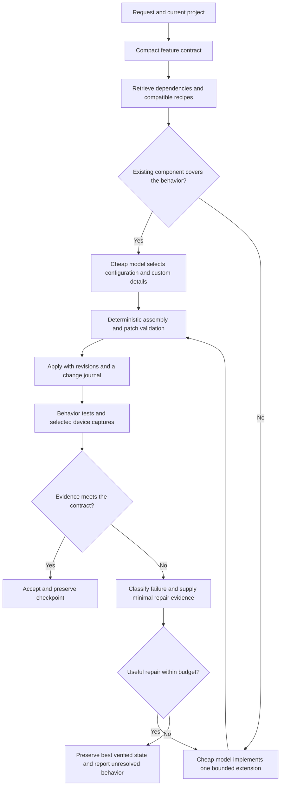

# Better Roblox generations with the existing inexpensive models

Research date: **2026-09-13**. This extends the [initial strategy](04-improvement-strategy.md). It is a proposed system design, not a measured improvement to Lemonade. Research references and their limits are in [the literature notes](09-generation-research-sources.md).

## Recommendation and achievable boundary

Keep the existing cheap models online, but change the work they perform. Give them a compact specification, current project dependencies, versioned gameplay components, and independently checked feedback. Use ordinary code for repetitive construction, bookkeeping, validation, and recovery. Reserve model output for choices and changes that actually require judgment.

This can plausibly close much of the gap on common, well-specified Roblox features. **There is no evidence here that the same cheap model weights can match Astra on arbitrary novel games, difficult debugging, or artistic judgment.** A good surrounding system can improve Astra too. Compare both models inside the improved system before making a parity claim.

The strongest potential savings come from reducing how much code must be invented and how much failed work must be repeated. Prompt caching helps the bill but does not repair bad reasoning. A cheap model is also not necessarily a small model: deployment economics and parameter counts are different facts, and several providers do not disclose the latter.

Three distinct operating modes:

| Mode | Online generation | Offline work | Fits the request? |
|---|---|---|---|
| Existing weights only | Existing inexpensive models, deterministic tools and checks | Engineers author components, examples and tests | Yes; recommended starting point |
| Amortized expert work | Same inexpensive models; no required Astra call per request | Astra and engineers help create and verify reusable components, failure lessons and prompt candidates | Yes, if offline expert cost is included |
| Trained specialization | Fine-tuned or distilled model | Training data, training and new deployment | Optional later experiment; changes weights and may not be supported by existing vendors |

Using an expert offline is not model distillation unless weights are trained. Recipes and demonstrations transfer useful knowledge through the product. They do not transfer the teacher's general reasoning capability.

## What the Lemonade evidence actually tells us

| Observed evidence | Implication for this design | What remains unknown |
|---|---|---|
| [23 action handlers](evidence/plugin/source/061-StudioActions.luau), including edits, imports and playtests | Extend the existing tool contract rather than assume tools must be invented from scratch | Which actions the production agent chooses and how often |
| [runTests](evidence/plugin/source/091-runTests.luau) counts an error-free smoke run as one passing test | Completion needs explicit behavior assertions | Whether the backend already uses stronger acceptance gates |
| [playtest](evidence/plugin/source/085-playtest.luau) accepts test scripts and captures evidence | There is an existing foundation for a verification loop | Coverage, grader accuracy and per-task utilization |
| [editScript](evidence/plugin/source/071-editScript.luau) / [updateScript](evidence/plugin/source/094-updateScript.luau) lack an expected-source-revision contract | Add conflict-aware edits; stale context can otherwise cause both regressions and wasted repair | Frequency of production draft conflicts |
| [list](evidence/plugin/source/081-list.luau) is capped without a cursor; [Tree](evidence/plugin/source/108-Tree.luau) has fallback scans | Build paginated, revisioned retrieval with explicit truncation | Backend index/caching design and actual missing-context rate |
| [StudioActionService](evidence/plugin/source/135-StudioActionService.luau) has no local dispatch deduplication or general result outbox | Make delivered work recoverable before increasing agent activity | Backend redelivery/dedup behavior and observed incidence |

These are client observations and proposed consequences. Missing context, poor decomposition and weak visual direction are **generation hypotheses**, pending failed-run traces. Do not present them as discovered backend defects.

## Proposed execution path

The stages are logical responsibilities, not a requirement for separate agents or a model call at every arrow. A deterministic router can skip planning for a simple property change. A new game needs a dependency plan and feature milestones.

## 1. Replace repeated invention with tested components

Start with the request families most common in actual traffic, not the longest conceivable feature catalog. Candidate foundations: checkpoints and respawn, server-authoritative purchases, inventory, round transitions, player lifecycle, UI navigation, and persistence adapters. The initial priority among them needs traffic data.

Each recipe contains a stable ID and version; configuration schema; provided and required interfaces; client/server ownership; instance layout; lifecycle/cleanup behavior; compatible versions; regression tests; and small working examples. Dependency resolution rejects incompatible combinations. Generated extensions remain editable Luau with explicit ownership boundaries and preserve user customizations during upgrades.

Example: “Add a sword shop” should usually choose a purchase recipe, bind an existing inventory and currency service, configure the item catalog, and generate the requested presentation. It should not repeatedly invent debit logic, duplicate-request handling, remote names and player cleanup. Novel mechanics use a bounded extension interface or the general edit path; unsupported behavior must not silently disappear into the nearest template.

Use a typed intermediate representation for instances, component bindings, remotes, UI and layout. Deterministic code expands it into concrete changes, checks API/property compatibility and returns a compact manifest. This reduces output tokens and inconsistent names. Valid JSON is only structural validity: the compiler and runtime checks still need to validate meaning.

Semantic operations should have inspectable plans and narrow contracts, for example `instantiateRecipe(recipeId, version, bindings, config, expectedRevision)`. Preserve lower-level tools for custom behavior. Avoid one opaque “buildAnything” tool with no actionable failure information.

## 2. Give the model the relevant current project

Maintain a graph linking features, scripts, module exports, require relationships, remotes, instances and tests. Index identifiers and exact text first; add semantic retrieval only when it improves recall. Static analysis will miss dynamic requires and instance paths, so label uncertain edges and supplement them with observed execution and targeted search.

For a purchase change, supply the currency API, inventory API, purchase handler, UI binding, relevant tests and current hashes. Include authoritative source for touched code, not only a prose summary. Provide expansion tools for missing dependencies; do not make a fixed context budget an information cutoff.

A starting experiment could target 8–16K input tokens for a typical feature and 1–3K for a narrow repair. These are tuning hypotheses, not model limits or proven optima. Measure whether shrinking context drops necessary evidence. Keep project decisions and accepted contracts outside chat, reference them by revision, and invalidate stale summaries when source changes.

Use stable component documentation and tool schemas as a cacheable prefix, followed by current task evidence. Never keep obsolete source in context merely to preserve a cache hit. Anthropic's [context engineering guidance](https://www.anthropic.com/engineering/effective-context-engineering-for-ai-agents) supports selective retrieval and compact persistent state; it does not prove a particular token budget for Roblox.

## 3. Verify player behavior, then repair the smallest cause

Use several checks with different failure coverage:

| Layer | Example | Important limit |
|---|---|---|
| Syntax / types / API | Parse Luau, resolve imports, check known Roblox properties and remote payload contracts | Standalone Luau needs suitable Roblox definitions; types do not prove gameplay |
| Pure logic | Purchase debit, inventory bounds, round state transitions | Mocks do not prove Roblox replication or lifecycle |
| Studio scenario | Two clients purchase, die, respawn and join a round | Requires working integration and deterministic fixtures |
| Visual / interaction | Phone shop opens, labels fit, touch action purchases correctly | A screenshot alone cannot establish the interaction |
| Regression | Existing sprint, inventory and respawn behavior remain intact | Select by dependency graph, with broader milestone checks |

Define acceptance before generation. Keep final acceptance tests outside the generator's write scope. Generated reproduction tests can supplement these, but a model must not certify itself by rewriting its own expected results. Mutation checks should verify that known bad implementations actually fail the oracle. Record assertions executed and require a minimum meaningful set; a process starting without errors is not a successful feature.

Roblox currently documents programmatic multiplayer testing through [StudioTestService](https://create.roblox.com/docs/reference/engine/classes/StudioTestService). Validate actual client capability/version first. Extend the inspected single-player playtest path to use the relevant supported mode; do not assume current Lemonade already exposes multiplayer automation. See [Studio testing modes](https://create.roblox.com/docs/studio/testing-modes).

A repair packet should contain the failing assertion, expected/actual values, relevant original error stack, affected script ranges and hashes, prior patch, and a concise record of unsuccessful approaches. Classify syntax, missing dependency, logic, stale revision, transport and visual failures separately. Re-fetch stale source; resend a lost result from an outbox; change code only when code is the problem.

Start with at most two targeted repair attempts per feature as an experiment. Stop earlier when there is no new evidence or the same failure repeats. Permit wider decomposition for a genuinely complex task under a separate total budget. Another attempt is worthwhile only when measured incremental acceptance gain justifies its incremental dollars and latency.

Do not default to five parallel full-game generations and a cheap model voting on them. Candidate diversity can help, but it multiplies construction and verification cost. Trial two isolated patches only for a specific unresolved function with discriminating tests. The selected output's measured success matters; “at least one candidate worked” does not prove the selector returned it.

## 4. Treat visual generation as constrained design

Correct code will not by itself make a good-looking or enjoyable game. Give each project an art brief: palette, material family, scale, silhouette language, lighting, typography, density, landmarks, controls and interaction feedback. Retrieve coherent asset families with bounds, collision information, attachments, usage rights and versioned provenance. Use curated UI components as foundations with room for project-specific art direction.

Generate a spatial plan before hundreds of Parts: zones, paths, spawn points, objectives, camera positions and approximate budgets. Deterministic placement checks reject overlaps and obvious unreachable layouts. Analytical jump estimates are only a filter; verify movement in the actual character controller. Keep seeded generation for reproducible repairs.

Capture a few high-value states: initial spawn, core interaction, failure/success and a target phone viewport. Inspect the rendered game rather than only the edit-mode arrangement. Run cheap geometric checks for overlaps, off-screen controls and blocked paths; use a vision-capable model from the permitted cheap pool where available. If the existing model cannot inspect images, screenshot storage alone does not close the visual feedback loop.

Keep reviewer feedback concrete: which object or control, where, what violates the brief, and the smallest suggested change. Calibrate visual judgments against blinded human preferences. Preserve the best verified iteration; later versions can become worse even when a model gives them higher scores.

## 5. Fix execution failures that waste model work

Before widening the loop, introduce immutable run/session/request envelopes, replay suppression, acknowledged result delivery, cancellation boundaries and resource scheduling. Check source revisions against the editor's current content when applying a patch. Roblox's [UpdateSourceAsync](https://create.roblox.com/docs/reference/engine/classes/ScriptEditorService) supports current-content callbacks; these must handle re-invocation without side effects and cancel conflicts rather than silently overwrite drafts.

Journal mutations and report partial rollback honestly. Isolate alternative candidates; serialize conflicting writes, play mode and device changes. These mechanisms need their own failure-injection checks. They improve dependable execution regardless of model, but their production savings cannot be quantified without incident traces.

Keep large intermediate values outside model messages. Return IDs, counts, diffs and concise failures; fetch details on demand. Batch deterministic property/instance operations within declared dependencies. Media transfer bytes, image inference tokens and text tokens are separate costs. The inspected plugin already has R2 upload paths and concurrency limits: optimize measured waste rather than claiming all screenshots still travel as inline base64.

## 6. Improve prompts offline and keep learning bounded

Create a development set of representative failures. For each, identify whether the missing ingredient was knowledge, context, execution or reasoning. Add a small validated recipe/example or change the appropriate stage contract. Evaluate candidate prompts on a separate validation set, then freeze them before held-out evaluation. [GEPA](https://arxiv.org/abs/2507.19457) is a relevant open-source prompt-optimization approach to trial; its benchmark gains are not a forecast for Lemonade.

Astra can help author recipes, adversarial tests and concise lessons offline. Retain source provenance and validate behavior in Studio before promoting artifacts. Do not use a teacher's approval as the truth label. If training is later supported, compare its full amortized cost and maintenance burden against the simpler recipe/context system. The immediate plan requires neither fine-tuning nor a stronger model on every user request.

## Proposed implementation order after research

1. Obtain generation traces and fixtures; measure failure categories, actual prices and per-stage costs. Build truthful acceptance results and baseline comparisons.
2. Address client delivery/revision failures; instrument the existing playtest path with real assertions and immutable evidence.
3. Pick three frequent feature families; implement compatible recipes, bounded custom extensions and source-grounded context. Compare each addition independently.
4. Add targeted repair, scene constraints and device-aware visual checks. Keep only changes that improve the quality/cost/latency frontier.
5. Tune prompts and provider caching from measured runs; trial selective candidates only where the verifier can discriminate.
6. Consider training only if recurring residual failures justify it and enough verified data exists.

First pilot candidate: **a server-authoritative coin shop added to an existing game**, followed by a mobile HUD and checkpoint/respawn task. These exercise integration, visual quality and lifecycle preservation. This is a proposal for the next implementation phase; no production generator has been changed or benchmarked in this research pass.
