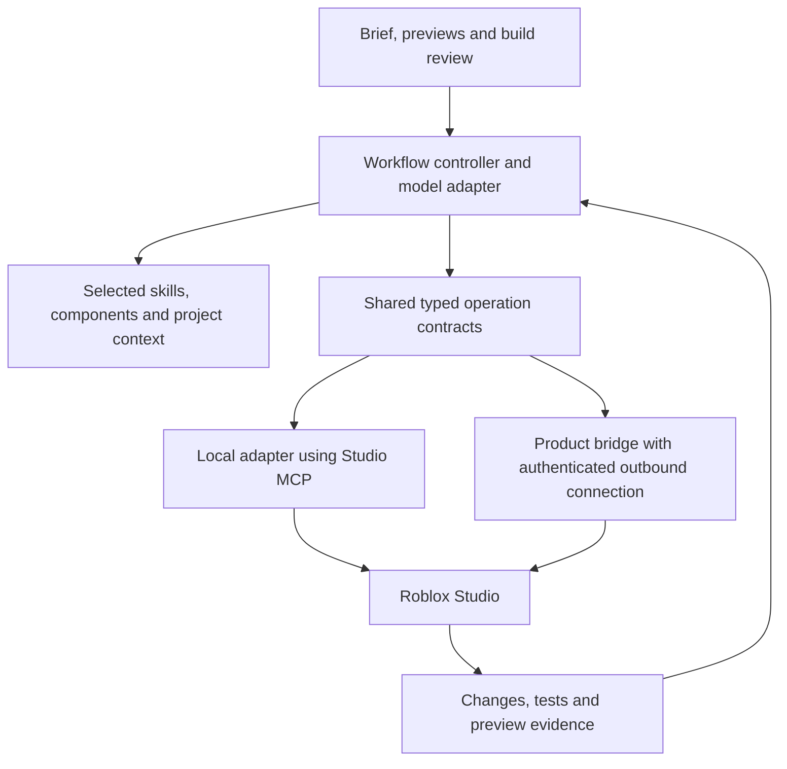

# A Cursor-inspired system for Roblox creation

Research date: **2026-09-13**. User direction: keep inference inexpensive, understand whole-game requests, clarify meaningful choices, preview assets/UI, then build and verify. This is a design and feasibility study. No generator, MCP server, installed skill or Studio project was changed.

## Can cheap models deliver strong-model results?

**It is a plausible product goal on a defined set of Roblox tasks, not a demonstrated universal capability.** A cheap model can deliver an excellent result when the system supplies missing knowledge, compatible building blocks, concrete requirements and reliable feedback. It may still fail on unfamiliar combat mechanics, subtle replication bugs, difficult integration and original art direction. Neither MCP nor a large prompt removes that capability boundary.

Assess three gaps separately:

| Gap | Example | Main intervention |
|---|---|---|
| Product understanding | A requested fighting game has no coherent combat/HUD/animation loop | Genre knowledge, selective clarification, preview and acceptance contract |
| Context or execution | Wrong remote name, stale source, unavailable animation, lost edit result | Current dependency graph, validated identifiers, reliable tools |
| Model capability | Cannot devise or debug a novel mechanic despite adequate evidence | Reduce scope into tractable pieces; measure the residual gap; optionally use a separately priced expert path |

The default design should not secretly call Astra when the cheap model struggles. Use the same inexpensive pool online, with transparent partial completion if the bounded repair policy cannot solve the task. Offline expert-authored components and tests remain useful, with their cost amortized as described in [the economics study](08-cost-and-parity-experiments.md).

## What to borrow from Cursor's published work

Cursor reports adapting instructions and tool formats to individual model versions, measuring both offline quality and actual user outcomes, and investigating tool failures. This supports treating model integration as an engineering project with versioned behavior, not one universal system prompt. [Cursor's harness engineering](https://cursor.com/blog/continually-improving-agent-harness)

Cursor also describes fetching context and tool definitions on demand. Its reported **46.9% token reduction** applied to an A/B-test subset of runs using MCP, with substantial variation. It is evidence that context packaging matters, not an expected Lemonade discount. [Dynamic context discovery](https://cursor.com/blog/dynamic-context-discovery)

Its semantic-search study reports improved code-question accuracy across the models evaluated, using both semantic and text search. For Roblox, test retrieval of live scripts, remotes, instances and accepted requirements together. A generic embedding index over code alone would miss important scene and runtime relationships. [Semantic search research](https://cursor.com/blog/semsearch)

Cursor's planning workflow researches the existing project, asks clarification and produces an editable plan. Our adaptation adds game-specific previews and a playable milestone before the full build. [Plan Mode](https://cursor.com/blog/plan-mode)

There is an important distinction with Cursor's own model: Composer 2's report describes continued pretraining and substantial reinforcement learning in its deployed tool environment. That capability is not explained entirely by prompts. Start with the transferable system design; custom training is a separate investment. [Composer 2 report overview](https://cursor.com/blog/composer-2-technical-report)

We have not inspected Cursor's private implementation or hidden prompts. These are adaptations of public engineering ideas, not claims to reproduce its internals.

## The layers should have different responsibilities

| Layer | Responsibility | Example |
|---|---|---|
| Product workflow | Controls discovery, previews, selected scope, build phases and user feedback | Full-game requests enter design review; a button-color edit goes directly to a narrow change |
| Skill | Supplies domain procedure, examples and checks | Combat requires synchronized input, attack states, feedback and lifecycle handling |
| Component library | Provides tested reusable implementation | Versioned damage, cooldown, animation binding and input modules |
| Tool | Executes a bounded operation and returns evidence | Preview an animation on the specified rig or run a named combat scenario |
| MCP | Connects the agent to tools/resources through a standard interface | Local AI client calls Studio tooling |
| Validator / executor | Enforces contracts independently of model prose | Reject unknown asset IDs, stale patches or incompatible rig bindings |
| Model profile | Adapts context, tool syntax and generation parameters to one model version | Patch format, selected demonstrations and repair packet format |

**A skill does not grant a new Studio API or permission.** It teaches use of existing capabilities and can package helper code. A tested executable wrapper adds dependable behavior. An enforced workflow prevents a model from skipping a required phase even when it ignores a prompt. Cursor's skills documentation likewise describes packages containing instructions, scripts and references. [Agent Skills](https://cursor.com/docs/skills)

## Current MCP feasibility: much already exists

Roblox now documents a **built-in Studio MCP server** using a local stdio process. The earlier open-source Rust bridge is archived and its README directs new users to the built-in integration. Prefer the current supported path for local prototyping. [Studio MCP documentation](https://create.roblox.com/docs/studio/mcp), [archived reference implementation](https://github.com/Roblox/studio-rust-mcp-server)

In this session, discovery exposed **29 Roblox Studio tool contracts**. The read-only `list_roblox_studios` call returned **zero connected instances**. This is stronger than assuming no connector exists, but it does not prove tool execution works on this machine. The exact metadata is saved in [the capability snapshot](evidence/tooling/roblox-mcp-catalog.json).

Observed contracts include script read/search/edit, tree/instance inspection, Luau execution, asset search/insertion, play mode, console output, screenshots, input simulation and content generation. These are separate from the 23 Lemonade plugin handlers inspected earlier.

One concrete gap matters for the user's animation idea: the exposed `search_asset.assetType` enum contains Model, Audio, Mesh, MeshPart, Image, Decal, Video and Package, **but no Animation value**. Do not invent an unsupported parameter. Animation discovery needs a separately verified path, a curated catalog of usable IDs, or inspection of permitted animation-containing models/packages. Search visibility and successful playback in the target experience are different checks.

## Build a small set of useful additions

Names below are **proposed tools**, not existing APIs. Implement helpers behind a small coherent tool surface; avoid one server per tiny operation.

| Proposed addition | Inputs and useful result | Why it earns a tool |
|---|---|---|
| `inspect_project_context` | Target/session, feature intent and revision → relevant scripts, dependencies, existing systems, truncation markers | Cheap models receive required context without guessing what to inspect |
| `find_asset_candidates` | Role, rig, style, target owner, budget → observed IDs and provenance, compatibility/permission status | Prevents invented assets and separates availability from suitability |
| `preview_animation_set` | Verified candidate IDs, rig and comparison layout → playable previews plus duration/marker/load results | A title or thumbnail cannot communicate attack timing |
| `preview_hud` | Versioned UI description, devices and interaction states → rendered mockup and layout findings | Lets the user choose an interface before gameplay wiring |
| `instantiate_component` | Version, configuration and dependency bindings → staged change manifest | Deterministic assembly avoids repeated low-level invention |
| `apply_checked_patch` | Expected revisions and allowed targets → exact changed revisions or structured conflicts | Makes edits recoverable and protects current source |
| `run_gameplay_scenario` | Named scenario, fixed seed, client/device profile → executed assertions, trace and captures | Turns game behavior into a usable repair signal |
| `review_feature_coverage` | Approved spec and evidence manifest → implemented/verified/untested/missing items | Prevents a persuasive completion message from hiding omissions |

Each tool contract needs target identity, schema/version, preconditions, bounded result size, cancellation, explicit failure categories and an idempotency policy where it mutates state. State-changing tools must produce a journal or other recoverable change record. A Lua execution wrapper that only returns “success” has not solved these problems.

An MCP SDK handles much of tool registration, schemas and transport. It does not implement the Roblox operation, truthful result semantics or recovery. [Official MCP TypeScript SDK](https://ts.sdk.modelcontextprotocol.io/server)

## Local prototype versus shipped web product

For a developer prototype, the local agent can use the built-in MCP. For a Lemonade-style hosted web application, the backend cannot directly access a user's local stdio process. It needs a local companion or a Studio plugin with an authenticated outbound channel and project/session binding. Evaluate reuse of Lemonade's existing bridge; MCP can be an adapter rather than a forced replacement of the transport.

Use one internal operation model across adapters, with capability negotiation and conformance tests. Keep device/play-mode locks, source revisions and result delivery authoritative at the executor. Do not assume the built-in server exposes an interface for registering arbitrary new native tools; a separate adapter/server can compose available calls, with a custom plugin only where a missing capability warrants it.

## Additional skills worth authoring

Begin with a small set whose benefit can be evaluated. These are proposed packages, not installed skills:

| Proposed skill | Required output | Evaluation case |
|---|---|---|
| Game brief discovery | Requirements with confirmed/defaulted/unresolved status; high-value questions | “Make a fighting game” produces a coherent scoped proposal without inventing user choices |
| Combat system design | Attack/state/input/server contracts and dependencies | No damage duplication, invalid-state attacks or missing respawn bindings |
| Animation integration | Rig bindings, timing/marker contract and fallback policy | Valid animation plays in the intended rig/experience; hit timing matches |
| Combat feedback | Animation/SFX/VFX/camera events tied to ability states | Miss, block and hit have distinct consistent feedback |
| Responsive game HUD | Health/resource/ability states with desktop/touch layouts | Cooldown and resource states match runtime and controls remain usable |
| Asset selection and preview | Short candidate set with provenance, compatibility and actual preview state | No fabricated ID, unobserved preview or permission assumption |
| Gameplay acceptance and repair | Independent evidence and a minimal root-cause patch | A silent combat failure is reproduced, fixed and checked for regression |

A package should contain a concise entry point, references loaded only when needed, configuration examples, tested helper code where appropriate, dependencies and positive/negative eval fixtures. Keep mandatory global rules short. Automatically attach the essential genre knowledge after task classification; weak models may fail to discover the very skill they need. Allow additional discovery for optional systems.

A skill should describe what it requires from tools and what evidence proves completion. It should not force every fighting game to include ranked matchmaking, monetization or a large ability tree. Shared domain knowledge proposes dependencies; user choices determine scope. Revisions to a skill should be evaluated separately from changes to its helper code and underlying model.

Roblox tool metadata exposes a skill-authoring guide, but it could not be invoked without a connected Studio. An official announcement about creator-authored skills was found; its full page was blocked by browser verification. We have not verified native custom-skill installation paths or runtime loading behavior. The initial portable skill packages can be hosted by our own agent controller independently of that feature.

## Difficulty and effort

These are engineering estimates for one experienced TypeScript/Luau developer with a working Studio and access to existing components. They are not delivery promises, and overlap means the rows should not simply be added.

| Scope | Rough effort | Main uncertainty |
|---|---|---|
| Connect and exercise the existing local MCP | Hours to a day when setup works | Client configuration, Studio version and connectivity |
| One simple custom read/validation tool | About 1–3 days | API access and precise return/error contract |
| Useful skill with examples and a small eval set | About 1–3 days for a familiar narrow task | Reliable procedure and representative failures |
| Animation/HUD preview plus scenario-testing prototype | Several weeks | Asset discovery/playback, rendering, input automation and cleanup |
| Production bridge and dependable multi-step editing | Several weeks to months | Reconnects, concurrent changes, recovery, deployment and compatibility |
| Broad polished game generator | Larger product effort | Component coverage, game feel, assets and real-user evaluation |

Writing an MCP wrapper is approachable. Making a tool that works across different places, rigs, devices and interrupted sessions is the demanding part. Creating many tools or long skill files is not a useful success metric.

## Cost policy and the next experiment

Retain the existing cheap-model pool. Use a short planning call for an ambiguous full game; deterministic logic tracks answered questions and missing required fields. Cache versioned recipes and stable context. Reuse asset metadata/previews within their validity windows. Generate one selected design, then repair only failed behavior. Charge neither a full game build nor expensive media generation merely to propose initial choices.

Treat planning cost as worthwhile when it reduces downstream wrong-direction work by more than its own cost and interaction delay. Measure abandonment and questions answered as well as accepted quality. Do not copy a frontier model's preference for highly autonomous context discovery without testing whether the cheap model can use it.

Use the [fighting-game walkthrough](11-fighting-game-discovery.md) as the next design benchmark. Compare the same cheap model with and without discovery/previews; then compare against an available Astra endpoint using equivalent context and tools. Measure requirement coverage, actual combat behavior, visual/user preference, intervention count, total cost and latency. No live benchmark has been run.
