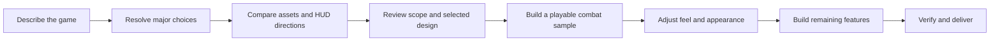

# A fighting-game request: proposed experience and execution contract

Research/design example, **2026-09-13**. This is a specification for the enhanced product, not a request to build a fighting game in the user's current Studio. No assets have been searched in a live Studio, purchased, inserted or previewed. All suggested mechanics below are examples, not user-approved choices.

## The intended user experience

For a broad request such as “Make a fighting game,” enter a short design conversation. For a precise request such as “Change the dash cooldown to four seconds,” inspect the existing configuration and execute a bounded change. Let users choose a guided design path or explicitly delegate choices. A generic game request alone does not imply agreement to every genre convention.

## 1. Recognize the genre's dependency structure

The system should immediately identify candidate requirements: combat rules, inputs, damage validation, character states, animations, feedback, camera, HUD, spawning and the round/core loop. Specialized abilities imply activation rules, cooldowns/resources, targeting and UI feedback. Mobile support implies touch controls and device layout checks.

These relationships belong in a versioned genre model. The cheap model proposes a mapping from the user's request to that model; deterministic checks flag missing dependencies. Distinguish required foundations, selected features and optional additions. This prevents “fighting game” from producing only a map and a damage script, while also avoiding an unsolicited complex progression system.

## 2. Ask a few consequential questions, with examples

Suggested first round, presented together as cards:

| Decision | Example choices | Why it matters |
|---|---|---|
| Format | 1v1 arena, free-for-all battleground, side-view fighter | Changes camera, targeting, round logic and networking |
| Combat identity | Hand-to-hand combos, weapon duels, ability-focused combat | Changes animation needs, hit detection and HUD |
| Visual direction | Stylized energetic, restrained martial arts, playful/cartoon | Guides assets, VFX, audio and interface design |

Read existing project settings where possible. Ask a second small batch only for unresolved structural choices such as rig, device support or initial content size. Provide recommended defaults and “choose for me.” Keep them marked as proposals until selected or explicitly delegated. Do not ask the user to decide remote names, script containers or every cooldown value.

Questions should reduce expensive uncertainty. A fully specified request can skip this step; an ambiguous full game may need more than one batch. Do not turn an arbitrary maximum question count into permission to guess a consequential unresolved choice.

## 3. Show a concrete design board

For each key animation role—idle/stance, basic attack, hit reaction, block and dash—present a small compatible candidate set. A card should identify creator/source, asset ID, rig compatibility, observed duration, cost when known, permission/load status and an actual preview when available. “Not yet previewed” must remain visibly distinct from “verified.”

The current exposed MCP search schema does not accept Animation as an asset type. Initial research should therefore establish an animation discovery path or build a curated team-owned catalog. Model/package search can supply leads, but its title does not prove usable animation content. Never fabricate candidate IDs or claim a thumbnail demonstrates motion. Asset accessibility can depend on the target experience; Roblox's official material documents permission checks. [Creator Store](https://create.roblox.com/docs/production/creator-store)

Preview candidates on the actual rig in a disposable preview environment. Inspect animation priority, loops, movement/root behavior and timing. Separate preview approval from permission to purchase, publish, or modify the user's place. This product flow can offer those actions explicitly when necessary.

Present two or three HUD directions using the **same intended component/schema renderer** as the eventual game UI where feasible. Include health/resource bars, ability slots, cooldown states, feedback and touch layout. Let users compare normal, cooldown, low-health and mobile states. An HTML sketch or generated image can communicate art direction, but it is not evidence the Roblox GUI will render or behave the same way.

Include a short SFX/VFX direction and a sample where feasible. “Heavy impact with brief sparks and restrained camera shake” conveys more than “good effects.” Do not generate multiple expensive complete games just to compare presentation.

## 4. Turn selected choices into a versioned build contract

Example after hypothetical selections: a stylized R15 arena brawler, initially two players, desktop and touch, a three-hit basic combo, block, dash and two abilities. This is an illustrative scope, not a recommendation that every fighter must use it.

| System | Concrete behavior | Evidence required |
|---|---|---|
| Basic combat | Inputs drive startup/active/recovery states; targets receive intended damage once per attack | Two-player scenario, repeat-input and multi-contact tests |
| Defensive state | Block follows the chosen rules and cannot coexist with incompatible attacks | State-transition assertions and visible feedback |
| Dash | Movement, cooldown and chosen vulnerability rules agree | Movement/obstacle scenario, resource/cooldown checks |
| Abilities | Each has a shared definition for input, targeting, timing, damage and cooldown | Server validation, HUD state and actual activation scenario |
| Animation | Chosen assets load on the specified rig; hit timing matches the attack definition | Runtime load evidence and timeline/marker inspection |
| SFX/VFX | Correct signals for hit, miss, block and ability events; cleanup works | Captures/event assertions and repeated-use observation |
| HUD | Health/resources/ability status match server-approved state | Client-state checks and desktop/touch interactions |
| Lifecycle | Death, respawn, join/leave and round reset recover correctly | Multi-client scenarios including mid-fight interruption |
| Arena | Spawn and combat space support the selected mechanic | Navigation, camera and collision checks |

Store each requirement with its origin (user choice, delegated default, inferred dependency), status, component references, asset selections, tests and build milestone. Both the user review and the generator read this same contract. A spec revision invalidates affected plans, previews and acceptance results; unrelated verified work remains reusable.

Do not allow a model to quietly remove “touch controls” because it was hard to implement. The coverage checker reports implemented, verified, not tested and unresolved separately. If the user changes scope, record it as a new revision.

## 5. Build a playable sample before completing the game

The first sample should demonstrate the core loop: movement, one attack, one opponent, health feedback, one selected animation, a hit effect and basic sound. It should run on the requested input device. Test the sample and let the user respond to feel: too slow, too floaty, too visually noisy or insufficient impact.

Only then expand to the full combo, defensive options, abilities, complete HUD, arena polish and round loop. This keeps a poor fundamental combat feel from being duplicated across a large roster. A more detailed initial build is appropriate when the user has already approved a known recipe and presentation.

Implement shared ability definitions so UI labels, cooldowns, animation timing and server checks agree. Favor tested state transitions and parameterized components; let the cheap model customize expressive details. Local visual responsiveness and authoritative game state must be designed together. Calling a module “server authoritative” does not prove all its remote inputs are validated.

## 6. Verify behavior and feedback, not just absence of errors

Required scenario examples for this hypothetical scope:

1. Player A attacks Player B; damage occurs once during the valid window and both clients observe consistent feedback.
2. Invalid range, blocked state, cooldown and replayed activation do not award unintended damage.
3. Death/respawn clears temporary effects and rebinds controls/HUD correctly.
4. A second player joins or leaves during combat without breaking the remaining player's state.
5. Phone controls activate the same abilities and never overlap essential movement controls.
6. Chosen animations and audio load in the intended experience; missing assets produce an explicit issue rather than a completion claim.
7. Repeated attacks release transient VFX/audio objects; agreed frame-time and instance budgets hold in a representative scene.

Run engine scenarios in appropriate Studio modes; pure Luau mocks cover only the deterministic parts. Keep protected acceptance criteria separate from generated reproduction tests. Use bounded repairs with actual failure packets. Subjective feel still requires human feedback or a calibrated perceptual reviewer; no automated assertion proves a game is fun.

## System enforcement and model instructions

The workflow controller should implement durable states such as `discovery`, `preview`, `ready_to_build`, `sample_review`, `building` and `verification`. A model request cannot advance a required state merely by claiming it is complete. A user edit can return only affected work to an earlier state. Checkpoints must survive reconnects and conversation summarization.

Use small phase-specific instruction sets, selected genre knowledge and authoritative runtime tool schemas. For weak models, attach essential source and knowledge proactively; leave optional references available on demand. Canonical IDs and explicit missing-value errors help detect fabricated APIs/assets, but they do not eliminate all reasoning mistakes.

The frontend shows ordinary product language: choices, previews, milestones and issues. Internal phase IDs, retries, tool names and prompt mechanics need not appear in the creator's flow. Show exactly which behaviors were exercised when declaring a result verified.

## Pilot metrics and cost checks

Compare the same cheap model on paired requests with and without this workflow. Include a precise existing-game edit so the system is penalized for unnecessary interviewing. Also include deliberately conflicting answers, changed asset selections and unavailable animation candidates.

Measure requirement coverage, first playable sample acceptance, full feature acceptance, false-completion rate, asset validity, edit preservation, visual preference, user corrections, abandonment, time spent answering, total inference/media/Studio cost and end-to-end latency. Counterfactual “questions saved money” requires comparison data; do not assume every question helps.

Then compare cheap and Astra versions of the same workflow on held-out tasks. The aim is strong delivered results at low cost. The working hypothesis is that better decisions and verified reusable behavior can close a large part of the gap for common requests; no measured parity or savings are claimed here.
