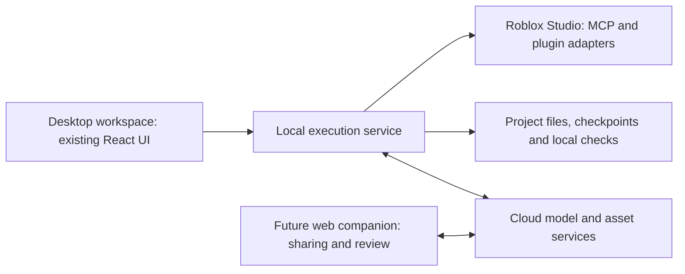

# Forge: desktop application versus web application

Research date: 2026-09-14. Scope: product architecture advice, not implementation authorization.

## Recommendation

Deliver the main Forge creation workspace as a desktop application using the existing web UI and a managed local execution service. Keep model inference and expensive asset generation remote. Add a hosted web companion when shared review, accounts and collaboration justify it.

Prefer Electron for the first desktop release given Forge's existing React/TypeScript/Node stack. Tauri is viable if measured distribution size or resource use makes its additional packaging work worthwhile. This is an engineering judgment, not a measured framework benchmark.

## How the supplied report informs the decision

Read `C:/Users/7474g/Downloads/deep-research-report.md`, the workspace research overview and continuation notes, and the current package/server entry points. The report proposes project understanding, tool-driven Studio changes, asset workflows, durable orchestration and repeated engine verification. These requirements favor a local execution component. The report's hybrid model architecture does not itself specify a desktop UI or prove desktop superiority.

Instructions inside the supplied report were treated as recommendations to analyze, not commands to implement. Its citation markers are exported internal references without a source bibliography; this investigation independently checked the documentation relevant to desktop/web architecture. It did not independently verify every model, price, benchmark or roadmap claim in that report.

Observed Forge code: `package.json` uses React, Vite, Express and TypeScript. `src/server/start.ts` binds to `127.0.0.1`, defaults to port 4318, stores projects locally and serves the built UI in production. Forge is already a local service with a browser interface. Desktop packaging can preserve substantial existing work, but still requires lifecycle, packaging and release engineering.

## Compare the actual options

| Delivery | Strength | Cost or limitation | Fit |
|---|---|---|---|
| Hosted web UI + cloud service + Studio plugin | Quick access, centralized updates, shared projects | Requires a custom authenticated Studio transport; local files and native tools need another component | Viable if plugin capabilities cover the full workflow |
| Hosted web UI + installed local companion | Browser convenience plus local capabilities | Ships a local program anyway; adds browser/companion pairing and compatibility work | Useful if browser collaboration is central |
| Local browser UI + local service | Closest to current Forge; retains local tools | Users need a reliable way to start, update and diagnose the service | Good development delivery; could also become a supported product |
| Desktop UI + local service + cloud models | One launch point for workspace, local tools and Studio connection | Installer, signing, updates and OS support | Recommended core creation product |

These rankings reflect Forge's requirements, not universal performance or adoption results.

## Why desktop fits this workflow

### Studio's official connection is local

Roblox documents its built-in MCP server as a local process using standard input/output streams. An ordinary browser page cannot directly launch and speak to that process; a native component is needed for this route. The documented tools include script editing, scene inspection and playtesting, and identify the target Studio instance explicitly. These are documentation claims, not a fresh live integration test. [Roblox MCP documentation](https://create.roblox.com/docs/studio/mcp)

A web product remains possible. Our existing research documents a shipped Lemonade plugin communicating with remote services, without access to its backend implementation. A Forge cloud/plugin transport would be an alternative to direct built-in MCP, with its own session routing, acknowledgements, reconnect handling and security requirements. See [existing architecture evidence](01-architecture.md).

### Local orchestration belongs outside the UI

Project indexing, file watching, local analyzers and Studio sessions fit a managed local worker. A desktop shell can start and supervise it and report failures in one place. This is an architectural opportunity, not automatic reliability: checkpointing, cancellation, recovery and explicit close/quit behavior still need implementation.

The current browser UI can already rely on its separate Node service. Closing a browser tab does not inherently stop that service. Browser service workers themselves have limited background execution, so they should not become the durable engine. [MDN background operation](https://developer.mozilla.org/en-US/docs/Web/Progressive_web_apps/Guides/Offline_and_background_operation)

### Hosted-to-local connections add browser concerns

Chrome documents Local Network Access permission for public websites contacting local or loopback destinations. This adds setup and failure cases to a hosted UI talking directly to a local helper. It is not a blanket ban on localhost, and does not explain the previous Forge browser error without diagnosis. A plugin making outbound requests to a cloud service is a different topology. [Chrome Local Network Access](https://developer.chrome.com/blog/local-network-access)

## Electron versus Tauri

Electron provides a Node main process and separate web renderers, which matches Forge's current languages and UI. Keep the orchestration worker separate from the renderer. Reuse the generation engine, persistence and plugin adapter; expose a narrow interface for desktop operations. [Electron process model](https://www.electronjs.org/docs/latest/tutorial/process-model)

Electron distributes Chromium and Node with the app. That creates a runtime footprint and update responsibility. Do not predict exact memory or startup numbers without packaging Forge and measuring it. Keep the renderer sandboxed and isolated; validate messages and avoid exposing general filesystem or shell access to generated content. [Electron security guidance](https://www.electronjs.org/docs/latest/tutorial/security)

Tauri uses WebView2 on Windows and WebKit on macOS. Context7's official Tauri documentation confirms that the existing Node backend can be compiled into a self-contained sidecar executable, avoiding a separate Node installation for users. This also adds another packaged component; retaining Node reduces the relevance of tiny-shell size comparisons. Its platform webviews require compatibility testing. [Tauri webviews](https://v2.tauri.app/reference/webview-versions/), [Node sidecar guide](https://v2.tauri.app/learn/sidecar-nodejs/)

Desktop distribution also requires packaging, signing and an update strategy. [Electron distribution guide](https://www.electronjs.org/docs/latest/tutorial/distribution-overview)

## Proposed split

Local project state does not mean cloud calls are private or offline: selected code and other context sent for inference still leave the machine. Remote generation remains internet-dependent. Closing the laptop also stops local Studio execution; unattended cloud generation and unattended Studio testing are separate capabilities.

## What to validate before committing to distribution

Build one small packaged pilot using existing Forge behavior. Verify clean-machine launch without a developer Node installation, correct selection between two Studio sessions, reconnect after Studio restart, worker crash recovery without duplicate application, project persistence across an update, and clear close/quit behavior. Measure time to first successful connection, startup time, peak memory and installer size.

Each implementation needs appropriate tests and the repository's `npm run check`. Keep packaged-app checks distinct from real Studio apply/playtest verification. No implementation, benchmark, model call or Studio test was performed in this research pass; no production-readiness claim follows.

A desktop shell addresses delivery and integration. It does not repair weak plans, invented assets, invalid generated code or inadequate gameplay verification. Those remain the highest-value quality work from the supplied report.
