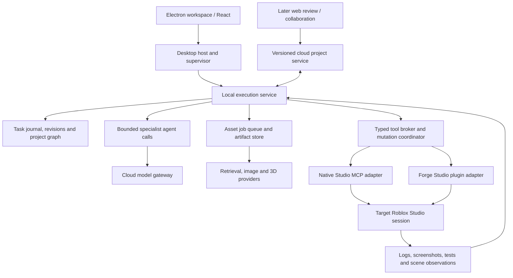

# Lemonate references: architecture decisions for Forge

Research date: 2026-09-14. Status: architectural recommendation; no application implementation in this pass.

## Decision

Build Forge as an Electron/React workspace backed by a supervised local Node execution service, with cloud inference and independently queued asset processing. Keep Roblox Studio as the authoritative execution environment. Use a durable task graph, revision-aware project representation and a typed tool broker to coordinate specialist agents.

Lemonate is a useful reference for separating editor, project access and runtime; representing nested assets; preview generation; and explicit lifecycle handling. It is not an established reference for production AI-agent orchestration. We should adapt its boundaries and some concepts rather than fork its engine or port its editor.

## Evidence and terminology

- **Lemonate.io / Luminocity is distinct from Lemonade.gg**, the Roblox product studied earlier in this workspace.
- The [May 26 article](https://lemonate.io/blog/desktop-subnodes-lifecycle) describes an experimental Electron desktop release, Tauri experiments, cloud-dependent projects, scene subnodes and changed frame hooks. It was read in the rendered browser; the initial HTML alone does not contain the article body.
- **Subnodes are scene objects**, including internal mesh/rig children. They are not child processes, microservices or LLM agents.
- **The article's lifecycle changes concern game-script frame timing.** Desktop startup, service recovery and task cancellation are a separate lifecycle problem we must design.
- The organization API listed five public repositories. Selected evidence includes 48 source/document/license files pinned to commits. Repository code is newer than the article. The engine recursive tree was truncated, so this was a targeted inspection, not an exhaustive audit.
- Code inspection found local project routing and Electron filesystem wiring in current source. That supersedes treating the May cloud-only description as the only implementation evidence. It does **not** establish a released, tested, fully offline product.
- No production cloud-server implementation was identified in the five-repository listing. Client APIs do not establish cloud deployment topology, service isolation or operational reliability.

See [source index](notes/lemonate-source-index.md) and [original evidence manifest](evidence/lemonate-2026-09-14/manifest.json). No downloaded application was installed or run, no upstream tests were executed, and no native Studio verification occurred.

### Pinned repositories

| Repository | Revision | Role observed |
|---|---|---|
| lemonate-studio | `49b4c75ab225675be055ab175ad6426732ee8655` | Vue/Quasar editor, Electron and Tauri shells |
| lemonate-gateway | `03cd440d11b56a5b2e744192c51a61eca565e91b` | Project model, REST access, caching, local storage and sync |
| lemonate-engine | `28f99d7861ad8fbdead6bc71dfe40cac4770c36e` | Rendering, scene hierarchy, Lua runtime and asset preview |
| lemonate-docs | `d303855fbf2392747998f8336f38b09ad77f8dc2` | Public documentation including lifecycle methods |
| lemonate-shared-ui | `b70070205fe260b4be2b44416f60fa9fe8a5e20f` | Shared UI library |

## What is worth adapting

### 1. Separate the editor from project storage and engine integration

Gateway's `IFileSystem` abstracts native filesystem operations; `IItemBackend` describes project-item, folder, attachment and binary operations. `ApiClient.openLocalProject()` switches routing to `LocalFsItemBackend`, clears caches and closes the collaboration socket. Studio injects `ElectronFileSystem` during initialization. These are executable source paths, not just README aspirations.

For Forge, use separate **ProjectRepository**, **ArtifactStore** and **StudioAdapter** interfaces. Keep provider calls, persistence and Studio operations outside React. Keep authentication/cloud transport separate from local project access. Opening saved local work should not depend on cloud login. Avoid one global client whose mutable local/cloud mode can accidentally redirect another project's work.

Sources: [IItemBackend](https://codeberg.org/Luminocity/lemonate-gateway/src/commit/03cd440d11b56a5b2e744192c51a61eca565e91b/src/filesystem/IItemBackend.ts), [ApiClient](https://codeberg.org/Luminocity/lemonate-gateway/src/commit/03cd440d11b56a5b2e744192c51a61eca565e91b/src/ApiClient.ts), [Studio initialization](https://codeberg.org/Luminocity/lemonate-studio/src/commit/49b4c75ab225675be055ab175ad6426732ee8655/src/store/index.ts).

### 2. Represent assets as structured, inspectable resources

`SgItemSubNode` wraps both engine items and Three.js objects, carries child relationships, and creates selection/skeleton helpers. The article describes imported subnodes as immutable while allowing attachments beneath them.

Adapt this as a **project graph** connecting Roblox Models, MeshParts, Bones, Attachments, constraints, scripts, remotes and asset references. Include provenance, ownership and editability. An agent should be able to find the actual hand attachment and its parent before placing a weapon. Names alone are insufficient identifiers; resolve handles against the current Studio session and expected object state.

Do not impose Lemonate's immutability rule on every Roblox imported descendant. Actual Roblox edit permissions, package relationships and user scope should determine allowed edits. A protected source asset plus explicit instance overrides is a useful design where appropriate.

Source: [SgItemSubNode](https://codeberg.org/Luminocity/lemonate-engine/src/commit/28f99d7861ad8fbdead6bc71dfe40cac4770c36e/src/scenegraph/SgItemSubNode.ts).

### 3. Use an asset-preview pipeline with interchangeable handlers

`AssetPreviewService` selects image/audio/mesh renderers through a registry, generates preview derivatives, uploads previews and properties, and explicitly disposes renderer resources.

Forge should normalize retrieved and generated assets into one pipeline: candidate → source/provenance record → validation → preview → Roblox import → in-engine inspection. Separate original binary, thumbnail, conversion result, Roblox upload ID and usage permissions. Keep large binaries out of prompts and event streams; pass immutable artifact references.

A local mesh preview can help selection and inspect geometry. It is not evidence that Roblox imported the asset correctly or that animations, materials or gameplay work there.

Source: [AssetPreviewService](https://codeberg.org/Luminocity/lemonate-engine/src/commit/28f99d7861ad8fbdead6bc71dfe40cac4770c36e/src/subsystems/preview/AssetPreviewService.ts).

### 4. Make stale runtime references detectable

`ScriptRunner.isVmCurrent()` checks a runner's stored generation against `ScriptEngine.vmGeneration`; destruction avoids calling into a replaced VM. This is a valuable concrete lifecycle pattern.

Give each Forge service incarnation, Studio connection and playtest a generation identifier. Bind observations and operations to those identifiers. A late result from the previous playtest must not validate the current artifact. A connected process is not automatically a ready service: require capability negotiation and project/session validation.

Source: [ScriptRunner](https://codeberg.org/Luminocity/lemonate-engine/src/commit/28f99d7861ad8fbdead6bc71dfe40cac4770c36e/src/subsystems/scripting/ScriptRunner.ts).

### 5. Separate persistent edits from temporary play state

Gateway has snapshots and undo queues, and `PlayModeUserEdits` explicitly distinguishes selected user changes during play from changes that should be rolled back.

For Forge, distinguish authoring edits, runtime observations and proposed fixes. An NPC moving during a test must not become a saved scene edit. Promoting a tested parameter should create a normal revisioned patch. Group undo by user operation/task, not merely by how close together edits occur in time.

Sources: [PlayModeUserEdits](https://codeberg.org/Luminocity/lemonate-gateway/src/commit/03cd440d11b56a5b2e744192c51a61eca565e91b/src/PlayModeUserEdits.ts), [UndoManager](https://codeberg.org/Luminocity/lemonate-gateway/src/commit/03cd440d11b56a5b2e744192c51a61eca565e91b/src/UndoManager.ts).

### 6. Restore editor layouts defensively

Studio's docking code restores layout state, attempts to reattach missing widgets and falls back to a known layout. Adopt versioned layout persistence and recoverable panels for Plan, Changes, Assets, Studio and Test Results. Keep the existing React UI; porting Vue/Quasar components would add migration work without advancing Roblox integration.

Source: [Dock restoration](https://codeberg.org/Luminocity/lemonate-studio/src/commit/49b4c75ab225675be055ab175ad6426732ee8655/src/modules/docking/dockcontainer.ts).

## What should be avoided or substantially changed

These are source-level observations and inferred failure paths, not measured production incidents or a complete security audit.

| Observed implementation | Why it is unsuitable as-is for Forge | Better approach |
|---|---|---|
| Electron filesystem IPC accepts caller-supplied paths and ignores the event sender | The shown handlers do not enforce project boundaries for reads, writes or recursive removal | Validate caller and payload; resolve project-relative references beneath an authorized root; protect against path escape and symlinks |
| Preload attempts to expose `ipcRenderer` and `process` alongside typed filesystem wrappers | Overly broad privilege surface; not an appropriate AI-facing interface | Narrow domain operations, isolated/sandboxed renderer, no raw IPC or shell exposure |
| `ProjectSync.sync()` pulls before pushing; metadata compares timestamps and differing binary hashes trigger a pull | A changed local binary can be overwritten before upload; no common-base conflict check is visible in this path | Base/local/remote hashes, explicit conflicts, immutable revisions and conditional updates |
| `JobManager` keeps watched jobs in memory; its fetch-error catch only logs | A failed poll can leave the promise unresolved with no next poll scheduled | Persist jobs, retry with bounded backoff, settle terminal states and reconcile uncertain operations |
| Editor access through global `Engine.instance`, which points to the most recently constructed engine | Implicit context is risky with several projects or Studio windows | Explicit project, Studio and runtime-generation identifiers in every operation |
| Tauri entry point shown only registers a greeting and opener | Existence of a Tauri directory does not prove parity with Electron's native filesystem integration | Ship one shell first; evaluate the other against actual lifecycle and integration tests |

Sources: [Electron main](https://codeberg.org/Luminocity/lemonate-studio/src/commit/49b4c75ab225675be055ab175ad6426732ee8655/src-electron/electron-main.ts), [preload](https://codeberg.org/Luminocity/lemonate-studio/src/commit/49b4c75ab225675be055ab175ad6426732ee8655/src-electron/electron-preload.ts), [ProjectSync](https://codeberg.org/Luminocity/lemonate-gateway/src/commit/03cd440d11b56a5b2e744192c51a61eca565e91b/src/filesystem/local/ProjectSync.ts), [JobManager](https://codeberg.org/Luminocity/lemonate-gateway/src/commit/03cd440d11b56a5b2e744192c51a61eca565e91b/src/JobManager.ts), [Engine](https://codeberg.org/Luminocity/lemonate-engine/src/commit/28f99d7861ad8fbdead6bc71dfe40cac4770c36e/src/Engine.ts), [Tauri entry point](https://codeberg.org/Luminocity/lemonate-studio/src/commit/49b4c75ab225675be055ab175ad6426732ee8655/src-tauri/src/lib.rs). The proposed IPC boundary aligns with [Electron's security guidance](https://www.electronjs.org/docs/latest/tutorial/security).

Do not adopt their Lua/Three.js runtime, physics implementation or render loop as a Roblox execution layer. Lua is not a substitute for Roblox Luau plus engine semantics. Do not build a second full Studio to validate what happens in the real one. The inspected sources also do not justify a microservice-per-agent or process-per-scene-node design.

## Recommended Forge architecture

### Deployment boundaries

| Component | Initially runs | Responsibilities |
|---|---|---|
| Desktop host | Electron main process | Windows, application lifecycle, narrow IPC, supervised worker startup, update coordination |
| Execution service | One local Node child process | Durable workflow, project context, tool authorization, model routing and cost accounting |
| Check/asset workers | Bounded local subprocesses or remote jobs as needed | CPU-heavy analysis, conversion and expensive generation; resource limits and cancellation |
| Studio adapters | Local connection and in-Studio plugin | Execute/observe actual Roblox operations; validate session and source state |
| Cloud service | Existing providers initially; dedicated service as product needs grow | Service-owned credentials, model access, remote artifacts/jobs and later accounts/collaboration |

Start with modules inside the execution service. Split a module into another process when its crash behavior, CPU demand or trust boundary warrants it; split it into a remote service when deployment/scaling requirements warrant that. A specialist agent is a bounded reasoning task, not necessarily a permanently running server.

For a commercial cloud gateway, the service owns account authorization and metering; client checks alone cannot enforce those. In local BYOK mode, provider calls may originate from the local service. Desktop UI choice does not determine where inference runs.

### Data ownership and synchronization

1. **Studio holds the live engine state.** Forge observations are revisioned snapshots with freshness information, not a perfect continuously synchronized replica.
2. **The local repository holds briefs, patches, workflow state and evidence.** Evolve the current JSON store toward a transactional journal (SQLite is a reasonable local candidate) when adding concurrent workers; atomically update job ownership, budget reservations and events together.
3. **Artifacts are immutable blobs addressed by hash.** A manifest maps them to project revisions, source/provenance, derived previews and Roblox IDs. Cache eviction must not discard the only copy of an unsynced artifact.
4. **Cloud synchronization is explicit revision exchange.** Track a common base; a conflicting offline edit creates a merge/review state, not a timestamp winner. Upload blobs before committing manifests that reference them.
5. **Choose one script synchronization authority per project.** Native Script Sync, Rojo or Forge's patch adapter must not race over the same files. Roblox documents Script Sync's behavior and limits; adopting it does not grant control of every Studio subsystem. [Script Sync](https://create.roblox.com/docs/scripting/sync)

### Services and operation lifecycle

Services should move through `starting → ready → draining → stopped`, with `failed/recovering` paths. Readiness includes protocol version, capabilities and target session checks. The supervisor restarts only processes it owns and preserves the journal. Closing a window and quitting the execution service need explicit product behavior. Before an update, drain operations or checkpoint them into an honest interrupted state.

Each tool request should include `operationId`, `taskId`, `projectId`, `studioId`, `sessionGeneration`, `playtestId` where relevant, `baseRevision`, expected source/object hashes, deadline, capability and artifact references. Some are Forge protocol fields, not existing Roblox MCP parameters.

Use durable receipt tracking and deduplication; assume delivery may repeat. If Studio changes the scene and disconnects before acknowledgement, mark the outcome uncertain and inspect the affected state before retrying. Do not promise universal exactly-once execution. Cancellation stops new work, requests cancellation from active providers/tools and records late results without applying obsolete artifacts.

One coordinator should serialize conflicting mutations per Studio session, including Edit/Play transitions. Parallel preparation is useful; concurrent uncoordinated scene mutation is not. A time-limited ownership lease plus an incrementing fencing token prevents a restarted old worker from continuing to write after a new owner takes over. Recheck actual Studio preconditions because a human or another plugin may also edit.

### AI-to-engine interaction

Use a stable internal tool vocabulary: inspect graph, read/patch scripts, search/inspect/import assets, apply scene patch, start/stop test, simulate input, collect evidence and revert a known change. Route operations through MCP or the Forge plugin according to observed capabilities. Roblox currently documents local stdio MCP, explicit Studio IDs, script/asset tools, playtesting, capture and input simulation. Re-discover capabilities on connection; documentation does not prove availability in every installed version. [Roblox MCP](https://create.roblox.com/docs/studio/mcp)

For script edits, use current editor contents and preconditions; `ScriptEditorService.UpdateSourceAsync` can retry its callback when editor content changed, so its callback must remain side-effect-free and must not invoke a model. Use Studio change recordings for grouped editor undo where supported. Uploads, provider charges and filesystem effects require separate recovery records; they are not one atomic Studio transaction. [ScriptEditorService](https://create.roblox.com/docs/reference/engine/classes/ScriptEditorService), [ChangeHistoryService](https://create.roblox.com/docs/reference/engine/classes/ChangeHistoryService/Undo)

Lemonate's frame hooks are a reminder to model execution phases, not a hook API to copy. Ground generated behavior in Roblox's actual client/server contexts and scheduler phases. For example, rendering callbacks cannot replace server-authoritative damage handling. [RunService](https://create.roblox.com/docs/reference/engine/classes/RunService)

### Agent coordination

The coordinator owns the task graph and budgets. A planner produces dependencies and interface contracts. Script, asset and test specialists receive only their required context and return patches, artifact references and evidence. Route bounded tasks to cheaper models when evaluated quality supports it; escalate ambiguous planning and difficult failures. Independent verification must include executable checks, not only another model's opinion.

Allow parallel asset search and script preparation against the same snapshot. Reserve write sets; when tasks share a remote or module contract, establish that interface before implementation. Integrate patches into a candidate revision, validate, then acquire the Studio mutation slot. Cap aggregate model concurrency and budget; several individually cheap agents can still increase total cost.

## Example: add a turret-defense feature to an existing game

1. Inspect the existing scene, scripts, remotes and build restrictions. Compile the request into requirements and acceptance scenarios.
2. Establish the placement/targeting/damage contracts. Run a script specialist and an asset specialist in parallel; prepare tests against those contracts.
3. Retrieve a valid turret asset or generate a candidate. Record provenance, inspect its hierarchy and permissions, and preview it. Missing upload permission is a missing input, not permission to invent an ID.
4. Combine script and scene patches into a candidate revision. Check Luau, API usage, dependencies and server/client responsibilities.
5. Recheck Studio source hashes and apply through one session coordinator with a change record.
6. Test placement, invalid placement, targeting, damage, destruction and respawn. Collect server/client logs and native captures against the candidate revision.
7. Feed the concrete failed assertion and relevant context to repair. Re-run the affected checks and appropriate regressions.
8. Present the verified change, remaining unknowns and cost. Keep temporary runtime movement separate from saved authoring changes.

## Implementation sequence and acceptance

| Phase | Deliverable | Required evidence |
|---|---|---|
| 1. Desktop foundation | Package current React/Node Forge; supervise service; preserve projects | Clean-machine startup, restart, close/quit and update behavior; no developer Node requirement |
| 2. Reliable tool execution | Explicit session identity, receipt journal, preconditions and cancellation | Lost acknowledgement, worker crash, stale callback and two-Studio-session tests |
| 3. Project/asset context | Revisioned graph and asset manifest/preview pipeline | Rename/reference preservation, invalid asset rejection, dependency closure and native import checks |
| 4. Bounded agent parallelism | Task contracts, scoped context and controlled integration | Serial versus parallel comparison on task success, accepted-change cost, latency and rework |
| 5. Cloud project collaboration | Immutable artifacts and conflict-aware revision exchange | Concurrent edits, offline divergence, partial upload, authorization and reconnect tests |

Preserve Forge's existing generation engine, provider routing, revision/hash guards, bridge acknowledgements and checkpoints. Current `GenerationStore.recover()` honestly marks interrupted generation; it is not yet a durable distributed scheduler. Extend these foundations rather than replacing them with Lemonate's project model.

Every implementation still requires appropriate tests and `npm run check`. Offline unit/browser/packaged-process checks and actual Studio validation must be reported separately. This research makes no speed, cost, production-readiness or general model-quality claim.
