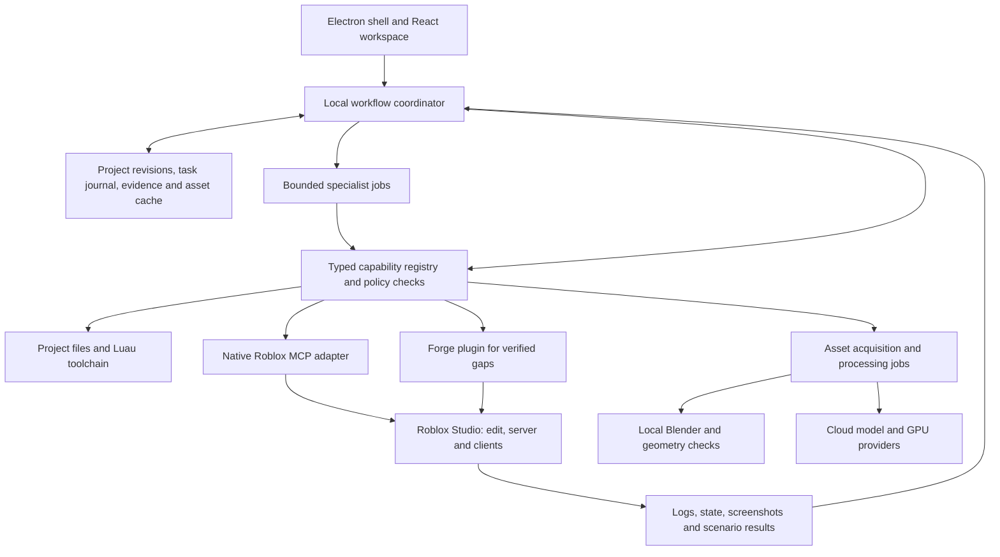

# Architecture after reviewing the 55 references

Research date: September 14, 2026, America/Toronto. Fetch timestamps in evidence use UTC and therefore include September 15. This is a research proposal, not an implemented migration.

## Recommendation

Build Forge as a **desktop application with a local execution service, Roblox Studio as the authoritative engine, and optional cloud generation workers**. Keep the existing React/TypeScript application and its project/revision safeguards. Improve its generation, observation and recovery loop before adding a large multi-agent framework or distributed infrastructure.

The most useful combination is:

- **Roblox native MCP and current Creator documentation** for engine capabilities.
- **Summer** for discoverable project knowledge and evidence metadata.
- **Vitric, Vollkorn Godot MCP and renew** for test scenarios, observable outcomes and repeatable execution interfaces.
- **Clay** for a shared tool registry and separate asset generation/processing stages.
- **Aider and the earlier OpenHands SDK review** for focused context and runtime boundaries.
- **Nixera** as a small Roblox-specific example of specialist delegation, with significant changes to authority, persistence and budgeting.

Use these patterns independently. None of these repositories supplies a verified, complete Roblox generation platform ready to transplant.

## What was actually reviewed

All **55 numbered resources** are accounted for in the [decision matrix](19-resource-decision-matrix.md). The pass includes README screening for 45 GitHub repositories, current official documentation and GameDevBench v2, plus focused static source inspection in eight repositories. We retained 33 selected source/schema/test files at exact commits. The earlier Lemonate review contributes separate pinned evidence; it was reused rather than represented as new work.

Evidence levels:

- **Source:** a behavior found in the named source path at the recorded commit. Static inspection does not prove deployment or frequency.
- **Documentation:** upstream public documentation or README; feature, maintenance and quality statements remain upstream claims unless independently checked.
- **Paper:** a reported experiment, with its dataset and harness limits.
- **Proposal:** our design judgment for Forge, not a claim about an upstream implementation.

See the [source index](notes/resource-survey-source-index.md) for commits, collection metadata and access limitations. No upstream project was installed, built, run, or connected to Studio. No GPU/model benchmark, paid generation, app-server restart or Studio modification occurred. Instructions embedded in upstream files were treated as reference content.

## Corrections that materially affect the shortlist

1. **Lemonate subnodes are scene descendants.** Its article discusses mesh/rig children and engine frame hooks, not a subprocess supervisor or multi-agent lifecycle. Lemonate.io/Luminocity is also separate from Lemonade.gg. See the [prior source review](17-lemonate-architecture-review.md).
2. **Summer's open package is not the complete engine.** Its README identifies the CLI, MCP server, library and integrations as open; the desktop editor/runtime is currently closed source. Its knowledge organization remains useful without depending on that engine. [Summer](https://github.com/SummerEngine/summer)
3. **Nixera's inspected coordinator asks for sequential delegation.** It tells the model to delegate to one specialist at a time; it is not evidence that a simultaneous designer/coder/tester swarm is cheaper. Role restrictions are largely prompts while specialists receive the same Studio tools. [Coordinator](https://github.com/Nixera-Studio/roblox-ai-studio/blob/c88d2e57a5ca52381b49f488ee13a0fd7c3beae9/backend/src/agents/coordinator.ts), [specialists](https://github.com/Nixera-Studio/roblox-ai-studio/blob/c88d2e57a5ca52381b49f488ee13a0fd7c3beae9/backend/src/agents/specialists.ts)
4. **Beckett Lite and Full are different surfaces.** The public README assigns automated input-driving/assertion playtesting to the paid Full edition; the open Lite repository includes runtime observation. Its claim that models degrade above a particular tool count is not a general empirical law. [Beckett](https://github.com/beckettlab/beckett-godot-mcp)
5. **Several framework references have changed status.** Continue says its repository is read-only and no longer actively maintained. SWE-agent recommends mini-SWE-agent. AutoGen is in maintenance mode, and both it and Semantic Kernel point new development toward Microsoft Agent Framework. These are current upstream notices, not a reason to migrate Forge to another ecosystem. [Continue](https://github.com/continuedev/continue), [SWE-agent](https://github.com/SWE-agent/SWE-agent), [AutoGen](https://github.com/microsoft/autogen), [Semantic Kernel](https://github.com/microsoft/semantic-kernel)
6. **Demo operation is not asset-generation verification.** MyMeshy's README documents fallback to mock generation without appropriate GPU/model support. Clay separates wired GPU implementations from unsupported modes. Forge must retain the actual backend and output type in every asset receipt. [MyMeshy](https://github.com/felippeomgt/mymeshy), [Clay runtime](https://github.com/OpenX-Inc/clay/blob/eb41696224cca3021b44b244fda1362e6d3a535e/src/clay/gpu_backend/runtime.py)
7. **Rojo is no longer accurately summarized as only one-way.** Its current README describes `syncback` and optional two-way support for supported edits, while acknowledging limits converting existing projects. This does not remove ownership/conflict problems. [Rojo](https://github.com/rojo-rbx/rojo)
8. **A repository's license badge is insufficient for its whole stack.** nAIVE's README distinguishes engine and platform licensing; Summer distinguishes open tooling from closed engine; generative model weights and dependencies have their own terms. Do not adopt another project's summary of a model's commercial permissions as the authoritative license. This pass makes no legal clearance determination.

## Source findings worth adapting—and changing

### Nixera: a useful minimal delegation example

The coordinator can handle simple requests directly or call a specialist with a fresh, self-contained message. Each role can use a separately configured model; results are written to a shared blackboard. Agent events carry identity, tool summaries and usage. These are useful building blocks for understandable delegation.

The inspected implementation also shows why Forge needs stronger controls:

- `bridge.ts` uses a process-global queue and pending map. Its timeout removes the pending promise but does not remove an undelivered queue entry. **Static consequence:** a timed-out call could still be delivered later when a plugin polls. The queue is not a durable receipt log.
- `run.ts` checks budget before an agent run and accounts for usage after the run. A multi-step run can exceed the remaining allowance; it is not a hard pre-reserved monetary budget.
- Specialists share mutation-capable tools, including the planner and reviewer. “Do not write code” in a prompt is not enforced permission separation.
- Compaction falls back to keeping recent history if summarization fails. Critical project facts should survive outside a lossy summary.
- Its coordinator prompt says the user must press Play. Current Roblox documentation describes native play control and Studio test APIs; do not inherit an older bridge's capability ceiling.

Adapt narrow delegation inputs, role-tagged events and explicit model routing. Add scoped tools, immutable task inputs, durable receipts, cancellation propagation and per-call budget reservations. [Bridge](https://github.com/Nixera-Studio/roblox-ai-studio/blob/c88d2e57a5ca52381b49f488ee13a0fd7c3beae9/backend/src/bridge.ts), [runner](https://github.com/Nixera-Studio/roblox-ai-studio/blob/c88d2e57a5ca52381b49f488ee13a0fd7c3beae9/backend/src/agents/run.ts)

### Summer: evidence-aware project memory

Its resource schema distinguishes tools, skills, examples, templates, collections and references. Descriptors include routing conditions, compatibility, status and evidence fields. The project memory reader surfaces the brief, art/audio direction, plan, template commit and engine/toolkit version with bounded file summaries. Validation checks resource relationships, evidence dates and media paths; capability lint scans for suspect instructions.

Adapt this as a small Forge knowledge registry: each reusable gameplay component or skill has a version, dependencies, applicable scenarios, tests, engine/tool versions and evidence references. Retrieve only the relevant entries. Keep user requirements, observed facts and tentative hypotheses distinct.

Do not mistake a `verified_at` field or a regex lint pass for behavior verification or a security boundary. A changed script or Studio version must invalidate affected evidence. Agent-written notes cannot promote themselves to verified status. [Schema](https://github.com/SummerEngine/summer/blob/40bf15fc9571eb68344c1cc38351c0a83aa1c687/registry/schemas/resource.schema.json), [memory](https://github.com/SummerEngine/summer/blob/40bf15fc9571eb68344c1cc38351c0a83aa1c687/src/project-memory/project-memory.ts), [validation](https://github.com/SummerEngine/summer/blob/40bf15fc9571eb68344c1cc38351c0a83aa1c687/scripts/validate-library/index.ts)

### Vitric and renew: tests must identify what they proved

Vitric's playtest code constructs independent simulation instances for worker sessions, labels results by strategy/seed and restores output order. Its gate replays recordings and checks assertions. This is useful inspiration for scenario manifests, bounded exploratory testing and compact failure evidence. **However, an absent or empty gate configuration returns `pass: true` in the inspected code.** Forge should report `not_tested` or fail a required coverage gate in that situation. [Swarm](https://github.com/BlackBearCC/vitric/blob/0bc50601c354f73b74e548ddec39bdf9ca79bc24/crates/vitric-playtest/src/swarm.rs), [gate](https://github.com/BlackBearCC/vitric/blob/0bc50601c354f73b74e548ddec39bdf9ca79bc24/crates/vitric-cli/src/gate.rs)

renew records input against simulation ticks and defines explicit target/run sets for comparing deterministic output digests. Copy the principle that a test's scope must match its claim. Its README labels all modules early and unstable. Do not import its engine, custom JSON implementation or determinism assumptions. [Determinism checks](https://github.com/renew-engine/renew/blob/913c885854616bc0ddd3410373bbb24d1d9b3b64/tools/cli/src/determinism.rs), [recording](https://github.com/renew-engine/renew/blob/913c885854616bc0ddd3410373bbb24d1d9b3b64/crates/replay/src/record.rs)

Roblox tests can have repeatable fixtures, recorded actions, controlled clocks in pure modules and semantic assertions. That is different from promising identical physics, timing, pixels or whole-world replay across machines. Use tolerances, explicit readiness conditions and repeated scenarios where appropriate.

### Unity/Godot bridges: fewer round trips, explicit sessions

Vollkorn's `send_key_sequence` sends actions, waits, state checkpoints, screenshots and signal collection through one engine-side sequence. This is a strong pattern for a **bounded scenario tool**. Add total duration/step/output limits and cancellation in Forge; a large batch is not inherently safe or atomic. [Handler](https://github.com/Vollkorn-Games/godot-mcp/blob/632530638448ea3e79394fbf74e9a5c92c4b67e5/src/handlers/interactive-handlers.ts)

Coplay's batch handler executes commands sequentially, checks disabled tools, returns individual results and explicitly reports `parallelApplied: false`. Its registry groups tools for selective visibility; its remote session registry scopes lookup by user and project. Adopt bounded grouping and explicit target identity. Do not call a batch a transaction: this handler does not roll back earlier successes on later failure. [Batch](https://github.com/CoplayDev/unity-mcp/blob/2fcc17957823f2494b7b1f7ade92c0fb56f4adb1/MCPForUnity/Editor/Tools/BatchExecute.cs), [tool registry](https://github.com/CoplayDev/unity-mcp/blob/2fcc17957823f2494b7b1f7ade92c0fb56f4adb1/Server/src/services/registry/tool_registry.py)

Julian Kerignard's documented cache/invalidations and Ivan Murzak's categorized editor tools are useful references. In Forge, cache by revision and invalidate on observed human edits/reconnection, not only elapsed time. Loading hundreds of tool schemas into every model request would work against the user's cost objective. Tool count is not a quality metric.

### Clay: one capability definition, multiple callers

Clay's registry generates MCP and model-function schemas from one tool definition; its result envelope distinguishes success from structured errors. Its pipeline separates generation from post-processing. Preserve these boundaries in Forge, using the project's existing schema tooling rather than introducing another schema language. A single domain operation should serve UI, CLI, MCP and tests.

Extend the contract with asset identity, backend/version, provenance, job status, cancellation, artifact hashes, import readiness and measurable acceptance checks. A textured mesh is not yet a usable Roblox prop, rig or character. [Registry](https://github.com/OpenX-Inc/clay/blob/eb41696224cca3021b44b244fda1362e6d3a535e/src/clay/tools/registry.py), [pipeline](https://github.com/OpenX-Inc/clay/blob/eb41696224cca3021b44b244fda1362e6d3a535e/src/clay/pipeline.py)

### Wraith: authoritative command/event architecture

The dispatcher validates queued commands and publishes rejection/acknowledgment events with user and command identity. The module manager tracks loaded/active/failed state and shuts loaded modules down in reverse order. These are useful patterns for editor communication and service status.

Its modules are **in-process engine modules**, not isolated OS workers. Its own native renderer and WebRTC streaming do not establish that Roblox Studio can be embedded, hosted headlessly or replaced by a browser viewport. Apply the command/event boundary to Studio and build a real OS-process supervisor separately. [Dispatcher](https://github.com/Tamely/WraithEngine/blob/27c66ad17a8cf276ee67f7baa05d0c745b27e082/Axiom/Scene/Session/EditorCommandDispatcher.cpp), [module manager](https://github.com/Tamely/WraithEngine/blob/27c66ad17a8cf276ee67f7baa05d0c745b27e082/Axiom/Core/ModuleManager.cpp)

## Proposed Forge architecture

### 1. Desktop and service lifecycle

Electron is the current fit for the existing React/Node stack; the prior desktop decision remains. Keep privileged execution outside the renderer behind narrow typed IPC. A web companion can later inspect projects, plan work and review results; local files, tool processes and Studio require a connected local worker. Cached project editing can work offline, while cloud inference and online asset services still require connectivity.

Start with a modular local service, not dozens of microservices. Supervise expensive or crash-prone tools such as Blender separately. Track `starting → ready → busy → draining → stopped`, with `failed` and reconnect paths. Use readiness probes, bounded restart backoff, process-tree cleanup and protocol/version negotiation. A child restart creates a new execution generation and invalidates stale handles. An app update must drain/checkpoint before replacing a worker.

For later cloud integration, let the authenticated local worker establish an outbound connection. Bind work to account, project, device and session. Cloud services receive necessary artifacts and return proposals/results; the local service revalidates before Studio changes. Do not expose a generic shell or an unauthenticated Studio relay publicly.

### 2. Capability layer, not one giant execute-code tool

The native Studio MCP documentation currently describes a local stdio bridge, explicit `studio_id`, Edit/Client/Server targets, script operations, assets, input, screenshots and play control. Discover the installed catalog and callable permissions at connection time; documentation alone does not verify this machine's behavior. Prefer native MCP first and use the Forge plugin for measured gaps. [Official MCP reference](https://github.com/Roblox/creator-docs/blob/main/content/en-us/studio/mcp.md)

Expose a focused domain catalog: inspect, script patch, scene change, asset resolution, test scenario, debug evidence and export. Return structured errors with retryability, observed revision and artifact references. Keep arbitrary Luau as an explicitly scoped escape hatch; ordinary operations should use validated class/property metadata and expected hashes.

MCP is the external protocol boundary, not the workflow database or an execution sandbox. The latest spec resolves to **2026-07-28**, with stateless requests and optional extensions; do not assume a server supports every latest feature. Support the versions actually used by Studio and selected clients, and keep long-job persistence in Forge regardless of protocol extensions. [MCP specification](https://modelcontextprotocol.io/specification/2026-07-28)

### 3. Project representation and ownership

Use a versioned, typed **Roblox project manifest** covering requirements, scripts, managed instance identities, hierarchy, asset references, tests and toolchain versions. Keep binary assets outside it. Maintain a dependency graph from requirement → implementation → asset → test → evidence.

Authority must be explicit:

| Data | Authority |
| --- | --- |
| User requirements and art direction | Versioned project specification |
| Filesystem-managed scripts | Repository/files, when that ownership mode is enabled |
| Studio-managed scene or scripts | Studio edit DataModel, with recorded revisions |
| Running server/client state | That specific playtest session |
| Applied-result claim | Observed postcondition plus receipt |

Rojo is valuable for filesystem projects. Enable it per project or subtree, with **one synchronization owner** for each script. Do not let Rojo, a custom bridge and native script edits race on the same content. Preserve authored terrain, rigs and unsupported structures rather than claiming lossless JSON/YAML round-tripping. nAIVE/OpenUSD inspire readable composition; they are not replacements for Roblox's data model.

### 4. Durable workflows and safe recovery

Represent generation as persisted tasks: research/specification → plan → prepare scripts/assets → validate → apply → run → observe → verify → repair or finish. The scheduler—not the conversation—owns dependencies, retry counts, cost limits and completion state.

For each command record project revision, task ID, Studio ID, execution generation, target context, input hash, idempotency key and deadline. Persist intent before dispatch and receipt after observation. If an editor change may have succeeded but its acknowledgment was lost, first reconcile its postcondition. **A timeout is an unknown outcome, not permission to blindly repeat a mutation.** Reconnection must reject stale work.

A local transactional journal, for example SQLite after a migration test, is sufficient initially. LangGraph JS is a possible future orchestration implementation, not a required rewrite. Context7's current documentation confirms completed task results can be replayed but unfinished side effects still need idempotency. Temporal has the same fundamental activity boundary; it becomes useful when cloud jobs need independent workers, long-lived recovery and operational support. Do not install both merely to obtain a graph. [LangGraph functional API](https://docs.langchain.com/oss/javascript/langgraph/functional-api), [Temporal activities](https://docs.temporal.io/activity-definition)

### 5. Specialist agents and cost control

Keep one responsible coordinator. Launch specialists only for bounded independent work:

| Role | Input and output | Authority |
| --- | --- | --- |
| Planner/designer | Requirements and relevant project facts → mechanics, layout and acceptance plan | Read/project proposal |
| Coder | Relevant interfaces/files → patch and rationale | Own isolated working files |
| Asset worker | Art brief and budgets → candidates or processed artifacts | Asset staging |
| Reviewer | Requirements, patch, diagnostics → findings | Read-only |
| Tester | Accepted scenarios and fixture → evidence | Controlled test session |

Parallelize code preparation and asset work where dependencies permit. Serialize conflicting Studio mutations and test-session controls. Human edits and other clients still require conflict detection; an internal mutex alone does not protect the whole editor.

Route simple retrieval/classification to cheaper models or deterministic functions; reserve stronger models for ambiguous planning and failed repairs. Do not send every specialist the full conversation, every script, every tool schema and all screenshots. Shared state should hold references to artifacts; each job receives the relevant slice. Reserve cost before calls and reconcile actual usage, including retries, review, summarization, image processing and uncertain timeout charges.

The expected saving is a **hypothesis**. Compare total cost per accepted feature and wall time against a strong single-agent baseline. Unrestricted agent conversation can cost more, and a cheap model that repeatedly fails can be the expensive route.

### 6. Asset acquisition and generation

Resolve assets in this order when suitable: existing project/inventory → curated reusable components → Creator Store → procedural construction → custom generation. Unique art requirements can justify generation earlier; retrieval is not a mandate to reuse mismatched content.

Keep acquisition separate from gameplay coding. A job should progress through requested, acquired/generated, processed, validated, imported and verified states. Track provenance, model/version, prompt/reference hash, usage permissions, raw/processed hashes, dimensions, pivots, material/texture bindings, rig compatibility, collision strategy and target budgets. Stage third-party models with scripts disabled for inspection; preserve intentionally approved behavior separately. Creator Store documentation explicitly notes script-bearing assets and permission-dependent loading. [Creator Store](https://create.roblox.com/docs/production/creator-store)

Use Blender/Trimesh for deterministic conversion and checks; consider MeshLab operations when benchmarks justify them. ComfyUI can run versioned generation workflows behind an adapter. Hunyuan3D and TRELLIS are evaluation candidates, not selected production backends; test actual shapes, materials, latency, cost and model terms. Do not send GPU setup to ordinary users as a prerequisite for the desktop product.

Finish with Roblox import and runtime verification. The official importer supports common DCC formats, but a successful external export does not prove Roblox scale, materials, animation or collision behavior. An asset ID alone does not prove availability to the target experience. Open Cloud is appropriate for supported asset/publishing operations with API keys/OAuth; it does not replace a live editor/test adapter. [Importer](https://create.roblox.com/docs/studio/importer), [Open Cloud](https://create.roblox.com/docs/cloud)

### 7. Testing, debugging and observation

Use distinct evidence layers:

1. Schema, formatting, type/lint and pure Luau module checks.
2. Studio edit-state checks: created objects, source hashes, properties and dependencies.
3. Runtime assertions in actual server/client contexts, with inputs and logged outcomes.
4. Visual checks for framing, UI readability, animation and effects, using consistent views.
5. Multiplayer and device scenarios where required by the feature.

Current Roblox documentation exposes `StudioTestService` methods for play/run tests and multiplayer tests, including plugin-security launch methods and test arguments/results. This is a concrete candidate for a Forge scenario adapter, subject to capability checks and actual integration tests. It removes the need to assume all plugin-launched testing is impossible. [StudioTestService](https://create.roblox.com/docs/reference/engine/classes/StudioTestService), [testing modes](https://create.roblox.com/docs/studio/testing-modes)

Borrow Playwright's condition-based waits and test isolation, not its browser automation API for native Studio. Register event observers before triggering actions. A scenario should return setup identity, executed steps, assertion results, client/server logs and selected media. Preserve `pass`, `fail`, `not_run`, `blocked` and `inconclusive` separately. Do not let the repair agent weaken the accepted tests to get a green result.

Example: a requested attack combo passes only when the intended input produces the correct sequence, server-authoritative damage/cooldown, visible animation/effects, and consistent opponent/client observation. Setting health directly in a test proves neither input handling nor combat replication.

GameDevBench v2 reports **333 Godot tasks** and a best reported result of **53.8%**. GPT-5.4 improved from **41.1% to 52.0%** with screenshot/video support, but the table also contains regressions and cases where video alone outperforms combined feedback. This supports evaluating visual evidence, not claiming it always improves results or transfers numerically to Roblox. [GameDevBench v2](https://arxiv.org/html/2602.11103v2)

Create held-out Roblox feature tasks with fixed budgets and preserved failing seeds/fixtures. Compare single-agent versus bounded specialists, context selection, visual feedback and reusable components separately. Measure requirement coverage, regressions, native test success, human correction, latency and total accepted-feature cost. Neither SWE-bench scores nor a compilation pass establishes game quality.

### 8. Observability and editorial workflow

Propagate one trace identity from user request through model calls, asset jobs, Studio commands and tests. Record timing, attempts, token/cost accounting and failures, with large evidence stored as artifact references. OpenTelemetry supplies standard traces/metrics/logs; Forge still defines domain events and verdicts. [OpenTelemetry](https://opentelemetry.io/docs/concepts/observability-primer/)

The desktop workspace should expose the plan, assets, actual project changes, task status and evidence. Keep Studio as the 3D authoring/runtime surface; use browser previews for clearly labeled asset previews and UI studies. Do not build a second renderer before the generation loop is reliable. Recovery should show what completed, what changed, and what can resume.

## Implementation order for the existing repository

The original combat-only build plan is marked superseded. This proposal preserves varied user-driven generation and reusable components rather than returning to fixed whole-game templates.

| Order | Change | Existing seam | Acceptance evidence |
| --- | --- | --- | --- |
| 1 | Define capability/session discovery and one command/result contract | `src/generation/bridge.ts`, `capabilities.ts` | Target isolation, unsupported capability, stale generation and duplicate-result tests |
| 2 | Strengthen task persistence, budget reservations and recovery | `engine.ts`, `store.ts`, `providers.ts` | Crash/reconnect/lost-ack scenarios; no late stale mutation |
| 3 | Build a native Studio scenario adapter and evidence bundle | Bridge/plugin, diagnostics/validation | Real single-player then multiplayer tests; offline mocks separately labeled |
| 4 | Add bounded knowledge retrieval and evaluated skills/components | `research.ts`, `requirements.ts`, `roblox-context.ts` | Relevant retrieval, stale-evidence invalidation, varied requirement fidelity |
| 5 | Add an asset manifest/provider pipeline | Generation schema/export and new asset adapter | Real asset creation/retrieval, processing, import and runtime availability |
| 6 | Package the existing frontend/service as desktop | `src/web`, `src/server/start.ts` | Worker lifecycle, updates, restart recovery and safe IPC on target OS |
| 7 | Add specialist scheduling where the baseline reveals a benefit | Existing model routing and task dependencies | Same held-out tasks/budgets; total cost, quality and latency comparison |
| Later | Web companion and distributed cloud workers | Stable command/job contracts | Tenant isolation, offline reconnect, long-job recovery and capacity evidence |

Desktop packaging can be developed alongside the capability work if useful, but it does not itself improve generated games. Avoid an orchestrator rewrite until tests expose a limitation the selected framework actually solves. Temporal and Ray remain later options; Ray in particular does not make Roblox Studio into a supported headless cluster workload.

## Completion boundary

This review supplies a ranked architecture and an exhaustive resource matrix, with reproducible source references. It does not establish production readiness, model parity, numerical token savings or a working integration of the upstream systems. All application code, live server state and Studio content were left unchanged. Documentation/evidence integrity was checked; `npm run check` was not needed for this research-only pass.
