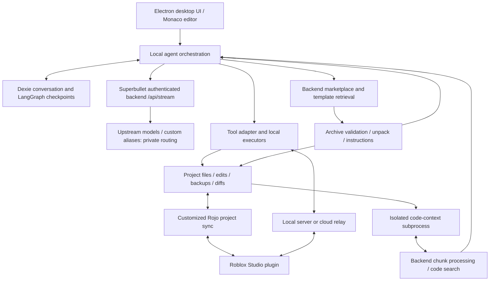

# SuperbulletAI 0.3.99 — installed architecture and reverse-engineering study

Inspected the user-designated installation at `C:\Users\7474g\AppData\Local\SuperbulletAI`. This is a read-only static reconstruction of shipped code, not a live generation benchmark or a reconstruction of the private backend. No application launch, authenticated request, model generation, session-store access, plugin installation or Studio operation was performed.

## Main finding

Superbullet is a desktop coding environment with a locally orchestrated agent, persistent conversations/checkpoints, project files, a Studio execution bridge, code indexing, and packaged reusable systems. The inspected release ships a LangGraph agent/tool loop alongside an older loop. Its server mediates inference and supplies parts of the model/prompt/tool configuration.

This is more substantial than a chat box that asks a model to emit an entire game. However, architectural sophistication is not measured generation quality. We have not tested whether it produces a better game, repairs more reliably, or costs less than Takko.

## Evidence and method

- Installed app: **0.3.99**, package main entry `obfuscated-main.js`; Electron distribution with Squirrel updater.
- Archive: `app-0.3.99/resources/app.asar`, **428,066,800 bytes**. Full archive SHA256 and per-file hashes are in the [manifest](evidence/superbullet-0.3.99/manifest.json).
- Preserved **532 selected application files**, approximately31.1MB, excluding bundled node_modules and editor assets. Original extracted bytes remain in [source](evidence/superbullet-0.3.99/source/package.json).
- Parsed and formatted **523 JavaScript files**; statically substituted literal string-table lookups in **520**. No target module was imported/evaluated. Original identifiers, opaque branches and unresolved expressions remain. These derivative files are inspection aids, not executable replacements or a complete deobfuscation. [Transformation record](notes/superbullet-0.3.99/static-transform.json).
- Parsed the bundled **plugin v0.1.36** XML into443 script sources, including dependencies and their tests. Twenty scripts explicitly carry Luraph protection, including most custom Studio integration modules. Two copies of the plugin in the archive are byte-identical. [Plugin index](notes/superbullet-0.3.99/plugin/index.json).
- Bundled Rojo manifest declares **7.5.2, revision45**, with a customized `rojo-superbulletai.exe`; the source Rust implementation is not supplied in the inspected application files.

The extraction covers shipped application code, not user credentials, billing state, private chat records or remote server source. Filenames, declarations and comments alone are not treated as proof a branch runs in every session.

## Architecture map

This diagram combines observed client calls and interfaces. The Models box is intentionally opaque; it was not inspected.

## Agent execution and persistence

`graph.js` constructs a LangGraph `StateGraph` with `agent`, `tools` and `summarize` nodes. The main loop routes agent tool calls to tool execution and back to the agent; another branch performs summarization and ends that graph invocation. State includes messages, session identity, mode and metadata. [Graph construction](notes/superbullet-0.3.99/readable/obfuscated-src/agent-engine/graph.js:658).

`engineFlag.js` defaults the new engine **on**, but supports global override and a flag pinned to each session. The legacy send/stream code also ships. Therefore this is a default code path with session-dependent behavior, not proof that the user's installed session currently uses it. [Engine selection](notes/superbullet-0.3.99/readable/obfuscated-src/agent-engine/engineFlag.js:77).

`AgentEngineSendProcessor.js` assembles model, tools, checkpointer and deferred instruction hooks; its main graph is configured with two maximum attempts in the graph retry policy. Streaming transport separately handles authentication refresh and rate-limit retries, so these limits should not be mistaken for one global cost bound. [Assembly](notes/superbullet-0.3.99/readable/obfuscated-src/agent-engine/AgentEngineSendProcessor.js:1472).

`DexieCheckpointer.js` hydrates and persists graph state by thread identity. Editing/re-streaming a conversation can rebuild checkpoint state from edited history. This creates a foundation for resuming work without restarting the entire conversation. It does not prove crash recovery is flawless. [Checkpoint implementation](notes/superbullet-0.3.99/readable/obfuscated-src/agent-engine/DexieCheckpointer.js).

Subagents have distinct graph construction, persistence, cancellation and concurrency control. Child tools explicitly exclude further spawn/resume delegation in the inspected assembly. Hardware tiers set concurrent workers to2,4,or unbounded for the high tier. The latter is a resource policy, not evidence of economic efficiency. [Child graph setup](notes/superbullet-0.3.99/readable/obfuscated-src/agent-engine/AgentEngineSendProcessor.js:1425), [resource policy](notes/superbullet-0.3.99/readable/obfuscated-src/config/systemResources.js:125).

## Models: what is actually identifiable

The following mappings are extracted as literal data without executing configuration code. Values are shipped client settings, not verified provider ceilings or prices. [Extracted configuration](notes/superbullet-0.3.99/model-config-extracted.json), [configuration source](notes/superbullet-0.3.99/readable/obfuscated-src/config/models.js:88).

| Displayed option | Backend model selector | Configured maximum output | Evidence qualification |
|---|---|---:|---|
| Claude Sonnet5, including Thinking option | `claude-sonnet-5` |128,000|Explicit named selector; actual inference not observed.|
| Claude Opus5, including Thinking option | `claude-opus-5` |128,000|Same qualification.|
| Claude Haiku4.5, including Thinking option | `claude-haiku-4-5-20251001` |16,000|Explicit dated selector.|
| BulletGPT-5.2, including Thinking option | `gpt-5` |64,000|Display and wire selector differ; exact server mapping unknown.|
| BulletMindV1-Beta | `bulletmind-v1-beta` |30,000|Underlying model, training and routing unknown.|
| BulletMindV1-Fast-Beta | `bulletmind-v1-fast-beta` |30,000|Pro-gated in client; underlying model unknown.|
| BulletLearnV1-Beta | `bulletlearn-v1-beta` |8,000|Marked free default; underlying model unknown.|
| BulletCode | `bulletcode` |15,000|Description attributes it to xAI; exact model/checkpoint unconfirmed.|
| BulletMindV1-Classic | `bulletmind-v1-classic` |4,096|Disabled and coming-soon flags in this release; do not count as active.|

The custom model descriptions include proprietary-training, comparative quality and cost claims. These are **product claims embedded in the client**, not proof of fine-tuning, exclusive weights, base-model identity or measured savings. No verified Composer, Kimi or Qwen identity was established behind those aliases.

The LangChain-compatible `SuperbulletChatModel` sends serialized messages to the backend's `/api/stream` with model selector, mode, session/version, engine, `includeSystemPrompts`, `extendedThinking` and optional `reasoningEffort`. It handles differing Claude/OpenAI-style content, thinking and tool stream events. [Transport](notes/superbullet-0.3.99/readable/obfuscated-src/agent-engine/SuperbulletChatModel.js:573).

Crucially, the inspected graph transport does **not** send the config's `maxTokens` field in that request body. Those large client values are not proof that every live generation actually receives that allowance. Likewise the local tool adapter does not expose the complete private prompt/schema arrangement. Server behavior must be observed separately before making stronger claims.

## Context and efficiency

There are three distinct mechanisms:

1. **Code indexing:** a separate Node process hosts `@zilliz/code-context-core`, exchanging newline-delimited JSON-RPC with Electron. It provides codebase indexing and snapshot/file-hash operations. The client uploads/processes chunks through backend indexing endpoints. This separates native indexing work from the renderer. The actual remote embedding model, vector database and ranking policy are not identified. [Subprocess](evidence/superbullet-0.3.99/source/code-context-subprocess/server.js), [backend chunk interface](notes/superbullet-0.3.99/readable/obfuscated-src/components/codeContextPanel/services/CodeContextApiClient.js:526).
2. **Conversation summarization:** per-model context limits and thresholds, an engine summarization flow, and context-limit checks. Some paths retain recent conversation chunks and compress older material. One summary instruction requests fewer than120words; its adequacy for complex tasks is unmeasured. Do not interpret a configured large context window as a reason to fill it. [Summarization](notes/superbullet-0.3.99/readable/obfuscated-src/agent-engine/summarize.js), [context checks](notes/superbullet-0.3.99/readable/obfuscated-src/agent-engine/contextLimit.js).
3. **A shipped token-optimization class:** contains replacement logic for large file/template results. However, searches found its class name only in its own file in the readable snapshot. Its active integration was **not established**, so it is not credited as a proven production saving. [Candidate component](notes/superbullet-0.3.99/readable/obfuscated-src/services/TokenOptimizationProcessor.js:225).

Their backend costs and actual cache-hit rates cannot be derived from these components. Context-retrieval quality, compaction losses and repeated tool output remain empirical questions.

## Marketplace-first behavior and reusable systems

`MarketplaceService` calls Superbullet's backend search with query/category/limit/minScore, then retrieves a chosen asset by ID, optionally using approved/latest channels. It also has media, canonical-resolution, purchasing and game-template paths. This is **Superbullet's backend marketplace interface**; it is not automatically equivalent to searching Roblox Creator Store. The backend catalog's contents and ranking remain unavailable. [Marketplace calls](notes/superbullet-0.3.99/readable/obfuscated-src/services/MarketplaceService.js:185).

The post-retrieval pipeline is more informative: archive inspection, prerequisites, asset validation, extraction, Studio unpacking, place/gamepass/product handling, utility retrieval and instructions. Its instruction handler reads packaged `Instructions.md`, substitutes installation-specific tokens and queues those instructions after the tool result. The graph's post-tool hook provides the route back to the agent. [Instruction handler](notes/superbullet-0.3.99/readable/obfuscated-src/components/chat/ToolCallHandler/MarketplaceAssetHandler/PostProcessHandler/InstructionsHandler.js:306), [deferred hook](notes/superbullet-0.3.99/readable/obfuscated-src/agent-engine/deferredInstructions.js).

This directly addresses our earlier context failure: the agent can receive the existing component's intended integration steps rather than having to infer everything from appearance or a short asset title. It does not prove every asset is safe, compatible or correctly described. The packaged `EndToEndScenariosRunner` covers retrieval scenarios such as zero/one/multiple hits and expiry; its name should not be mistaken for evidence of complete gameplay tests.

## Studio integration, editing and verification

The desktop tool surface includes file read/search, code search, instance inspection, Lua execution, atomic search/replace edits, template creation, Marketplace retrieval, lint checks, playtest start/stop, console reading and instance import into Rojo structure. There are task and subagent tools and a web-search interface labeled Exa. [Context tools](notes/superbullet-0.3.99/readable/obfuscated-src/services/ToolDefinitions/tools/context.js), [execution tools](notes/superbullet-0.3.99/readable/obfuscated-src/services/ToolDefinitions/tools/execution.js).

File editing integrates backups, diffs and conversation-chunk restore metadata. The local server tracks requests and timeouts; Rojo carries project-file synchronization. A separate cloud-relay path supports remotely connected Studio and playtest log polling. This is a two-way development workflow, not just exporting a generated script. [Edit operations](notes/superbullet-0.3.99/readable/obfuscated-src/services/file-management/fileSystemManagerComponents/EditFileOperations.js), [server](notes/superbullet-0.3.99/readable/obfuscated-src/main-process/server.js), [playtest bridge](notes/superbullet-0.3.99/readable/obfuscated-src/main-process/ipc-handlers/PlaytestIPCHandler.js).

`check_lint` returns errors/warnings and line/column diagnostics from the file/editor path. This is potentially useful for catching mistakes before Studio, but we have not demonstrated that its diagnostics catch our Vector3 error. Playtest log support is visible; comprehensive visual, audible, touch and acceptance validation was not established. [Lint executor](notes/superbullet-0.3.99/readable/obfuscated-src/components/chat/ToolCallHandler/ToolExecutor/tools/checkLint.js).

The custom plugin modules for MCP tools, workspace structure, serialization, asset validation and Studio unpacking are Luraph-obfuscated. We retained their exact source and interfaces/names, but did not recover their virtualized internal implementation or run them. Readable bundled Rojo/dependency code must not be substituted for missing custom-module evidence.

## What to adapt, and what remains unproved

| Pattern | Why it is worth testing for Takko | Qualification |
|---|---|---|
| Capability-aware model profiles | Avoid assuming every provider supports the same thinking controls. | Shipped settings still require wire-level verification; large limits alone are not optimization. |
| Reusable component plus installation contract | Preserve behavior and give workers clear integration instructions, media dependencies and expected results. | Closest fit to the user's Marketplace/context concern; verify actual assets natively. |
| Searchable, incremental project context | Retrieve relevant code instead of repeatedly sending full source inventories. | Must measure missed dependencies and total successful-task cost. |
| Persisted agent/task checkpoints | Resume a bounded task after interruption and inspect the state that produced an error. | Never silently replay paid calls or Studio mutations on recovery. |
| Lint and runtime feedback in the loop | Let the worker repair a demonstrated error before escalation. | Keep first-attempt quality and repaired success separate. |
| Reviewable edits and restore points | Make component adaptation concrete and reversible. | Existing Takko safeguards should be measured against it, not discarded. |

Do not copy their unbounded high-tier concurrency, assume opaque branded models are fine-tuned, or replace the existing system merely because LangGraph ships here. We can independently implement these patterns and compare full-system outcomes without copying proprietary application code.

The most valuable next comparison would give Superbullet and Takko the same small Marketplace-based task and score actual Studio behavior, human intervention, elapsed time and billed cost. **That comparison was not run in this study.** Hidden prompts, real model routing, marketplace inventory, backend implementation and generation-quality superiority remain open questions.
